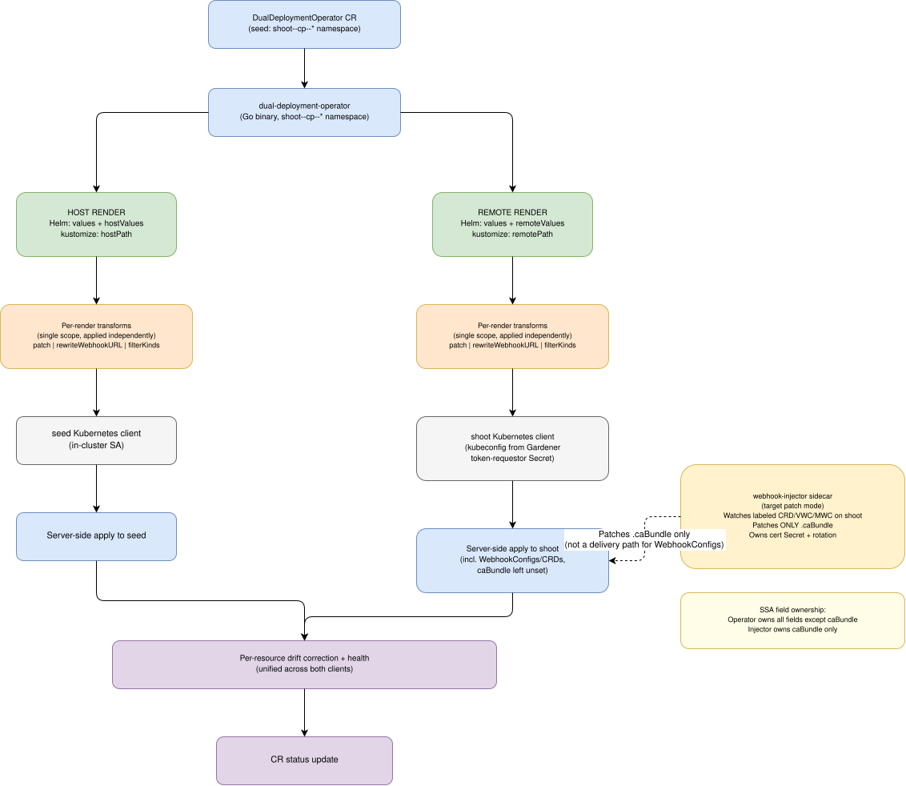
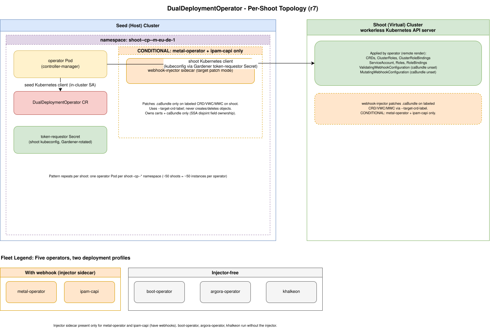

# dual-deployment-operator — Design Document

**Status:** Proposal
**Tracking issue:** [cc/unified-kubernetes#1294](https://github.wdf.sap.corp/cc/unified-kubernetes/issues/1294)
**Predecessor POC:** [sapcc/helm-charts#11633](https://github.com/sapcc/helm-charts/pull/11633) (kustomize-based, archived)
**Original problem:** [cc/unified-kubernetes#1169](https://github.wdf.sap.corp/cc/unified-kubernetes/issues/1169)
**Enabling change (r7):** [webhook-injector#14](https://github.com/SAP-cloud-infrastructure/webhook-injector/pull/14) — adds a label-scoped, direct-apply, caBundle-only "target patch mode" to the injector. This removes the two constraints that shaped r5/r6 (the injector's source-ConfigMap-only delivery and its ManagedResource-only CRD caBundle stamping), collapsing the cross-stream transformation scope and closing the §9.2 open limitation. See §2.2.4 and CONTEXT.md revision 7.

---

## TL;DR

A kubebuilder operator (`dual-deployment-operator`) that pulls **one artifact per operator** (Helm chart or kustomize source) from `sapcc/helm-charts`, **renders it twice with mode-specific configuration** (once for seed, once for shoot), applies typed Go transformations to each render independently, and **applies each render directly to its target Kubernetes API** — seed resources to the seed via the operator's own service account, shoot resources (including WebhookConfigurations) to the shoot via a Gardener-provided kubeconfig.

Key characteristics:

- **Two-render, no split.** Chart/kustomization determines what belongs to seed vs shoot via mode-specific configuration (Helm: `seedValues`/`shootValues`; kustomize: `seedPath`/`shootPath` selecting overlay directories). Each render produces only the resources for its target cluster. Operator does not decide routing; the source decides via what it emits per mode.
- **One artifact per operator, self-contained.** No wrapper + additions split.
- **Operator supports both Helm and kustomize** via a CR source discriminator (`spec.source.helm` xor `spec.source.kustomize`).
- **Small transformation menu:** 3 types — `patch` (DSL: strategic-merge or JSON Patch), `rewriteWebhookURL`, `filterKinds`. All per-render (a single scope). No general-purpose DSL, no scripting. `patch` replaces the historical `injectInitContainer` and `addLabels` typed types for patch-shaped operations. `renameKind` is not needed (was an artifact of ManagedResource-based delivery). The r5/r6 cross-stream `packageWebhookConfigsForInjector` type is **removed** in r7 — the operator now applies WebhookConfigurations directly to the shoot rather than packaging them for the injector (see §2.2.4).
- **Dual-cluster direct apply** — operator holds two Kubernetes clients per CR, applies seed + shoot uniformly with server-side apply + drift correction + per-resource health tracking. No `ManagedResource` wrapping. WebhookConfigurations and CRDs are applied by the operator with `caBundle` left unset (unowned), so the injector can own that one field.
- **webhook-injector retained for caBundle + cert lifecycle only.** Under r7 it runs in **target patch mode** ([webhook-injector#14](https://github.com/SAP-cloud-infrastructure/webhook-injector/pull/14)): it watches labeled CRD/Validating/Mutating WebhookConfiguration objects **on the shoot** (`--target-label`) and keeps their `.caBundle` in sync as certs rotate, patching **only** `caBundle` — it does not create, delete, or rewrite `clientConfig`. It does NOT deliver WebhookConfigurations from a source ConfigMap anymore (`--webhook-config-name` is left unset). The operator and injector write the same objects but **disjoint fields**: the operator owns everything except `caBundle`; the injector owns `caBundle` only. SSA field ownership keeps them from clobbering each other.
- **Zero `make build-` targets remain.** All pre-rendered YAML deleted.
- **Estimated size:** ~900-1200 lines of Go (slightly less than r6 — cross-stream scope removed), shared across all five current remote operators.
- **Deployment topology**: per-shoot (one operator instance per shoot-cp namespace), matching the webhook-injector's existing per-shoot footprint.

---

## 1. Background

### 1.1 The deployment topology

Five kubebuilder operators are deployed today in a split seed/shoot topology (earlier revisions of this document called these the "host" and "remote" clusters respectively):

- **`metal-operator`** — provisions bare-metal servers (`metal.ironcore.dev`)
- **`boot-operator`** — manages iPXE boot config
- **`argora-operator`** — SAP-CC integration for NetBox
- **`khalkeon`** — CobaltCore inventory sync
- **`ipam-capi`** — Cluster API in-cluster IPAM provider

For each:

- The operator's Pod (`controller-manager` Deployment) runs in the **seed cluster**, in a per-shoot control-plane namespace such as `shoot--cp--m-eu-de-1`.
- The operator's CRDs, ClusterRoles, ClusterRoleBindings, ServiceAccount, and webhook configurations live in a separate **shoot cluster** — a workerless Kubernetes API server with no Pods, where the operator's domain objects are served.
- The operator authenticates to the virtual cluster's API server via a kubeconfig (token-requestor pattern with Gardener-rotated tokens) and reconciles domain objects there.
- Webhook callbacks from the virtual cluster's API server reach the operator Pod in the seed via URL-based `clientConfig` (not service-based — the virtual cluster has no Pods to route a Service to).

### 1.2 Current implementation

For each of the five operators there is a wrapper Helm chart under `system/<operator>-remote/` (or for ipam-capi a kustomize source under `system/kustomize/ipam-capi-remote/` that helmifies into `system/ipam-capi-remote/`). Each wrapper:

1. Depends on the upstream operator's Helm chart (or kustomize source for ipam-capi)
2. **Disables** the upstream's `controllerManager`, `rbac`, `crd`, `webhook` at install time (`values.yaml`)
3. Pre-renders the upstream at **chart-source time** via `make build-<operator>-remote` — a Makefile target that runs `helm template` (or `kubectl kustomize | helmify`) piped through `yq`/`sed` for transformations:
   - Filter unwanted kinds (Service, sometimes ConfigMap/Secret)
   - Rename `Role` → `ClusterRole` (upstream emits namespace-scoped Roles; we deploy to a shared namespace and need cluster-wide grants)
   - Rewrite Validating/MutatingWebhookConfiguration `clientConfig.service` → `.url` (virtual cluster can't route to seed Services)
   - Label the CRDs+RBAC `ManagedResource` with the webhook-injector's `--managed-resource-label` so the injector's `ManagedResourceReconciler` finds it, walks its embedded CRDs, and stamps caBundle into those with a conversion webhook (relevant only for ipam-capi, the operator whose CRDs carry conversion webhooks)
   - Inject the webhook-injector sidecar as an `initContainer` into upstream's Deployment (metal + ipam-capi)
4. Commits the transformed YAML into the chart: `managedresources/*.yaml`, `webhooks.yaml`, `templates/controller-manager.yaml`
5. Delivers remote content via **three separate paths**:
   - **CRDs, RBAC, ServiceAccount**: `templates/managedresource.yaml` (chart Helm template) wraps each pre-baked YAML doc as a `ManagedResource + Secret` pair. Gardener's `gardener-resource-manager` (GRM) in each shoot's control plane picks up the MR and applies to the shoot.
   - **WebhookConfigurations**: `webhooks.yaml` (pre-rendered with URL rewrite) is packed into a `webhook-config` ConfigMap on the seed via `.Files.Get`. The **webhook-injector sidecar** (mounted alongside each operator Pod) reads this ConfigMap and applies the WebhookConfigurations to the shoot cluster via a mounted shoot kubeconfig.
   - **caBundle rotation**: webhook-injector also generates and rotates TLS certs, storing them in a seed-side Secret. On rotation it (a) re-applies the shoot's WebhookConfigurations with a fresh caBundle (via the source-ConfigMap path above), and (b) stamps `.spec.conversion.webhook.clientConfig.caBundle` into CRDs embedded in the labelled seed-side `ManagedResource` (via its `ManagedResourceReconciler`, selected by `--managed-resource-label`). Note: the injector's CRD-stamping path depends on the CRDs being delivered as a Gardener `ManagedResource` on the seed — it does not read any label on the shoot-side CRD objects themselves.

Concretely: `system/metal-operator-remote/managedresources/crds-and-rbac.yaml` is 5542 lines of pre-rendered upstream content, committed to git and regenerated by `make build-metal-operator-remote`.

Total across five operators: **~30,000 lines of committed generated YAML**, five bespoke Makefile targets with per-chart `sed`/`yq` invocations, no shared abstraction, and three separate remote-delivery mechanisms.

### 1.3 What hurts

- **Silent drift.** `make build-<operator>-remote` is not run in CI. Chart bumps depend on someone remembering to run it before committing. `yq`/`sed` version differences produce non-deterministic diffs.
- **Generated files pollute reviews.** PRs bumping upstream versions carry thousand-line diffs of rendered YAML that reviewers must skim manually to detect regressions.
- **Per-operator bespoke Makefile logic.** Five operators, five slightly-different Makefile targets. Adding a sixth operator means writing a sixth target.
- **Pre-rendering breaks values-time customization.** Any change that would depend on install-time values (e.g., URL prefix per-cluster, sidecar image tag override) can't easily be expressed because the content is baked at chart-source time.
- **Three separate remote-delivery paths increase surface area for bugs.** Split among GRM (MR), webhook-injector (WebhookConfig delivery), and webhook-injector (cert lifecycle). Debugging a broken remote state requires knowing which of the three delivered which resource.
- **The kustomize POC ([sapcc/helm-charts#11633](https://github.com/sapcc/helm-charts/pull/11633)) showed that a pure-tooling swap doesn't help.** Substituting kustomize for Makefile+yq produced **+79% LOC and +130% file count** vs. the current chart pattern. The problem isn't the tool; it's the pre-render-and-commit model.

### 1.4 What the POC established

The archived POC (`openspec/changes/archive/2026-05-13-poc-kustomize-metal-operator-remote/`) attempted to replace `make build-metal-operator-remote` with a pure kustomize overlay. Findings:

- **Kustomize can express the transformations** but doing so requires substantially more configuration than the current Makefile approach.
- **Flux `HelmRelease.postRenderers`** only supports kustomize, not arbitrary string composition — so URL rewrites via string prefix cannot be expressed at deploy time via Flux alone.
- **Webhook `clientConfig` cannot be avoided at chart level.** Upstream tightly couples webhook definitions (paths, names) to the controller code; we must consume upstream's WebhookConfigurations and transform them, not fork them.
- The chart's "consume upstream unchanged, transform locally" pattern is unavoidable; the question is only *where* the transformations run.

The POC's LOC verdict:

| | current chart | kustomize POC |
|---|---|---|
| LOC (per operator) | 820 | 1470 |
| File count | 10 | 23 |

The POC was archived with the verdict: **kustomize as a tooling substitute is worse than what we have. The next iteration must move the transformations out of chart-source time entirely** — either into deploy time (a controller) or eliminate them (upstream changes).

---

## 2. Alternatives considered

### 2.1 Rendering approach alternatives

Nine alternatives were surveyed for the rendering-and-transformation problem. Summary:

| Alternative | Why not |
|---|---|
| Keep current (Helm + Makefile sed/yq) | Fragile; drift-prone; 30k lines of committed generated files; not addressable in CI |
| Dual-kustomization POC | +79% LOC, +130% files vs. current — objectively worse |
| Pure Helm chart, no upstream fork | Webhook `clientConfig.service` must be rewritten to URL; Helm subcharts cannot post-process each other's output |
| Flux `HelmRelease.postRenderers` (kustomize) | Kustomize can't do string-prefix URL construction; also can't inject an initContainer whose spec references chart-time values cleanly |
| Gardener extension | Extensions are tied to shoot lifecycle events; our trigger is a manual deployment decision, not a shoot state change |
| Pipeline operator with a DSL | Reinvents kustomize with 3-5 transformations that don't justify a DSL; DSL invites scope creep |
| Chart-baked with operator for delivery only | Doesn't eliminate `make build-`; committed generated files stay |
| Chart-with-upstream-dep + operator for transforms (no kustomize support) | Works for 4/5 charts. Ipam-capi's upstream is kustomize, no Helm dep possible → still needs a `make build-` step. Asymmetric across the fleet. |
| **Operator with source discriminator (Helm + kustomize)** | Works uniformly for all 5. Requires operator to support two rendering engines (Helm SDK + krusty). **Chosen.** |

### 2.2 Delivery mechanism alternatives

Independent of the rendering choice, four delivery options were considered for getting rendered resources to their target clusters:

| Option | Seed delivery | Shoot CRDs/RBAC delivery | Shoot WebhookConfig delivery | Cert lifecycle |
|---|---|---|---|---|
| **A. Preserve today's mechanisms** (baseline) | Flux HelmRelease + Helm install | ManagedResource + GRM | webhook-injector sidecar reads seed ConfigMap, applies to shoot | webhook-injector generates + rotates certs, patches caBundles in shoot |
| **B. Option 1** | Operator directly (SSA) | Operator directly (second Kubernetes client) | webhook-injector unchanged | webhook-injector unchanged |
| **C. Option 2, r5/r6 form** (superseded by r7) | Operator directly (SSA) | Operator directly (second Kubernetes client) | webhook-injector, from a source ConfigMap the operator produces (`packageWebhookConfigsForInjector`) | webhook-injector unchanged (certs + caBundle injection into the WebhookConfigs it delivers) |
| **C′. Option 2, r7 form (chosen)** | Operator directly (SSA) | Operator directly (second Kubernetes client) | **Operator directly (SSA), `caBundle` left unset** | **webhook-injector target patch mode** — watches labeled WebhookConfigs/CRDs on the shoot, patches `caBundle` only; generates + rotates certs ([webhook-injector#14](https://github.com/SAP-cloud-infrastructure/webhook-injector/pull/14)) |
| **D. Option 3** | Operator directly (SSA) | Operator directly (second Kubernetes client) | Operator directly | **Operator absorbs cert lifecycle** — webhook-injector deleted |

The GRM-based baseline (A) is the current architecture. Options B/C/C′/D progressively fold delivery mechanisms into the operator. Revision 7 adopts **C′**: the operator is the single delivery path for *all* shoot resources (CRDs, RBAC, SA, additions, **and** WebhookConfigurations); the injector shrinks to caBundle + cert lifecycle only, coexisting via disjoint SSA field ownership rather than via a source ConfigMap. This is the "pure Option 2" that r5 wanted but could not have while the injector was ConfigMap-only and unmodifiable; [webhook-injector#14](https://github.com/SAP-cloud-infrastructure/webhook-injector/pull/14) removed that constraint (§2.2.4).

#### 2.2.1 Rejected: Option A (preserve MR + GRM for shoot CRDs/RBAC)

Argued for keeping the design as originally written in this doc's previous revision. Trade-offs:

- ✅ Gardener-idiomatic
- ✅ GRM provides drift correction, health tracking, keepObjects, token rotation
- ❌ Two separate remote-delivery paths (GRM for CRDs/RBAC, injector for WebhookConfigs) — same surface-area problem as today
- ❌ MR wrapping adds a Kubernetes-object-per-resource with a Secret-per-resource — proliferation
- ❌ Chart must emit `templates/managedresource.yaml`, adding complexity to the wrapper
- ❌ GRM benefits are **not additive to the operator's necessary responsibilities**: the operator must implement drift correction and health tracking for **seed resources anyway** (Flux HelmRelease doesn't drift-correct at the individual resource level, doesn't track per-resource health). Once the operator has these mechanisms for seed, applying the same code to shoot via a second Kubernetes client is nearly zero additional work. GRM adds a layer of indirection with no differential benefit.

**Rejected because**: MR/GRM's benefits are illusory relative to work we must do for seed anyway. The abstraction adds complexity without adding capability.

#### 2.2.2 Rejected: Option 1 (direct apply for CRDs/RBAC only, injector unchanged)

The half-measure. Trade-offs:

- ✅ Removes MR wrapping for CRDs/RBAC
- ✅ Uses the operator's drift-correction/health machinery uniformly for one class of shoot resources
- ❌ WebhookConfigurations still delivered via `webhook-config` ConfigMap + webhook-injector reads-and-applies loop
- ❌ Chart still has to emit the `webhook-config` ConfigMap, which is populated via `.Files.Get "webhooks.yaml"` — but under the new design there is no `webhooks.yaml` (upstream renders live). The ConfigMap-based delivery becomes awkward: the chart would need to emit a ConfigMap containing rendered WebhookConfigs, which the injector would then re-render and apply. Duplicative and clumsy.
- ❌ Doesn't reduce the number of remote-delivery paths (still 2 after eliminating MR: injector for WebhookConfigs + operator for CRDs/RBAC)
- ❌ Chart complexity retains the injector's contract (specific ConfigMap name, label conventions, etc.)

**Rejected because**: it retains the awkwardness of injector's WebhookConfig-delivery role without meaningful simplification. If we're going to change delivery, we should change it decisively.

#### 2.2.3 Chosen: Option 2 (direct apply for CRDs/RBAC AND WebhookConfigs, injector for certs only)

Trade-offs:

This subsection describes Option 2 as it stood in r5/r6 (form **C**). Revision 7 refines it to form **C′** — see §2.2.4. Both share the same core (operator applies CRDs/RBAC/SA/additions directly; injector handles caBundle + certs); they differ only in *how* WebhookConfigurations reach the shoot.

- ✅ **Operator is the single delivery path for CRDs, RBAC, ServiceAccounts, and the operator's own additions** — applied directly via one Kubernetes client, no `ManagedResource` wrapping
- ✅ Chart emits **no delivery-shaped resources** — no MR wrapper template, no hand-authored `webhook-config` ConfigMap, no `.Files.Get` indirection. Chart is purely a manifest source.
- ✅ Drift correction and health tracking apply uniformly to seed and shoot via the same operator machinery (which we build anyway for seed)
- ✅ Deployment topology becomes crisper: one operator per shoot-cp namespace with two Kubernetes clients (seed + shoot)
- ✅ CR status is the single source of truth for the resources the operator delivers
- ⚠️ (r5/r6 / form C) WebhookConfigurations were still delivered by the injector, not the operator — the operator produced the injector's source ConfigMap via the `packageWebhookConfigsForInjector` cross-stream transformation. This preserved the injector's ConfigMap contract without a `make build-` step, but left **two** remote-delivery paths (operator direct-apply + injector-via-ConfigMap). **Superseded in r7** — see §2.2.4.
- ⚠️ Requires the operator to hold a shoot kubeconfig — same credential model as the webhook-injector today, via Gardener token-requestor. No new mechanism.

**Preferred over Option 1 because** (comparison unchanged from r5/r6):

| Aspect | Option 1 | Option 2 (r5/r6 form C) |
|---|---|---|
| Remote delivery paths | 2 (operator + injector) | 2 (operator + injector-via-ConfigMap) |
| Chart complexity | Still has `webhook-config` ConfigMap contract with injector | Chart emits pure manifest resources; operator produces the ConfigMap |
| WebhookConfig update flow | Chart → ConfigMap → injector reads → injector applies | render → operator packages → ConfigMap → injector reads → injector applies |
| Injector's role | Full delivery + certs + caBundle | Delivery of WebhookConfigs (from operator-produced ConfigMap) + certs + caBundle injection |
| Operator scope | Applies to seed + partial shoot | Applies to seed + full shoot except WebhookConfigs |

Option 1 is a partial simplification that leaves an asymmetry between delivery paths for CRDs and delivery paths for WebhookConfigs. Option 2 (form C) achieved delivery uniformity for everything except WebhookConfigs; r7 (form C′) closes that last gap — see below.

**Preferred over Option 3 (absorbing injector entirely) because**:

Option 3 would require the operator to own TLS cert generation, rotation timing with overlap windows, and caBundle propagation. This is well-worn code in the webhook-injector today with known behavior. Reimplementing it in the operator is real work with real regression risk, for the marginal benefit of removing one Kubernetes Deployment (the injector). Not worth the trade in v1.

Option 3 remains a valid future consolidation if the injector becomes a maintenance burden or if we want a strictly single-component deployment. It is not a v1 goal.

#### 2.2.4 Chosen (r7): Option 2 form C′ — operator delivers WebhookConfigs directly, injector patches caBundle only

**What changed since r6.** Forms A–C and the r5/r6 design were all constrained by two properties of the webhook-injector *as it existed*:

1. It delivered WebhookConfigurations only by reading them from a **source ConfigMap** (`--webhook-config-name`) and could not be scoped to specific shoot objects by label. This is why r5 introduced `packageWebhookConfigsForInjector` (a cross-stream transformation) to produce that ConfigMap — the operator could not simply apply the WebhookConfigs itself and let the injector top up caBundle, because the injector would then *also* deliver them from the ConfigMap, double-writing.
2. Its only path to stamp `caBundle` into a **CRD conversion webhook** was its seed-side `ManagedResourceReconciler`, keyed on `--managed-resource-label`. Since this design emits no ManagedResources, that path never fired — leaving §9.2 as an open limitation blocking ipam-capi's production migration (ipam-capi is the operator with conversion-webhook CRDs; see §3.5.4).

[webhook-injector#14](https://github.com/SAP-cloud-infrastructure/webhook-injector/pull/14) adds an opt-in **target patch mode** that removes both constraints:

- **`--target-label=<key>=<value>`** — the injector watches labeled `CustomResourceDefinition`, `ValidatingWebhookConfiguration`, and `MutatingWebhookConfiguration` objects **directly on the shoot** and keeps their `.caBundle` in sync as certs rotate. It patches **only** `caBundle` (per-webhook merge by name via `StrategicMergeFrom` for MWC/VWC; `MergeFrom` for CRD conversion), never creates/deletes, and never rewrites `clientConfig` Service→URL.
- **`--webhook-config-name` becomes optional** — with only `--target-label` + `--cert-sans`, the injector runs a cert-only + patch mode: it owns the cert Secret and rotation state machine, applies no WebhookConfigs from any ConfigMap.
- Labeled CRDs participate in the injector's rotation gate, so cert promotion waits for shoot propagation (zero-downtime).

**r7's delivery (form C′):**

- ✅ **Operator is the single delivery path for *all* shoot resources** — CRDs, RBAC, SA, additions, **and** WebhookConfigurations — applied via one Kubernetes client with SSA. One remote-delivery path, kind-agnostic.
- ✅ **No cross-stream transformation.** `packageWebhookConfigsForInjector` is removed; the operator no longer moves WebhookConfigs between renders or emits a source ConfigMap. The transformation menu is a single per-render scope (§3.4).
- ✅ **Disjoint SSA *field* ownership** replaces disjoint *resource* ownership. The operator applies WebhookConfigs (and conversion-webhook CRDs) with `caBundle` **left unset**, so it never owns that field; the injector's target patch mode owns `caBundle` only. Two managers, same object, non-overlapping fields — SSA keeps them from clobbering each other, and there is no caBundle ping-pong.
- ✅ **§9.2 closed** — conversion-webhook CRD caBundle is now stamped on the shoot CRD directly by the injector's target patch mode; no ManagedResource needed. (§9.2 records this resolution.)
- ⚠️ **New coupling: a label contract.** The operator's WebhookConfig/CRD output must carry the injector's `--target-label` so the injector adopts them. This is a one-line annotation/label on those resources (added by the chart or a `patch`), and is strictly simpler than the ConfigMap name/dataKey/YAML-shape contract it replaces.
- ⚠️ **New deployment requirement: injector flags.** The injector sidecar must be started with `--target-label` (+ `--cert-sans`) and **without** `--webhook-config-name`. This is a deployment-manifest change, tracked as a migration step (§6).

**Preferred over form C because** it removes the last remote-delivery asymmetry (WebhookConfigs now flow through the operator like everything else), deletes an entire transformation scope and interface (§5.2), and closes the only open production blocker (§9.2) — at the cost of a label contract that is cheaper than the ConfigMap contract it replaces. The injector shrinks to exactly its specialty (caBundle + certs), which is the shape r5 originally wanted.

**Still preferred over Option 3** for the same reason as before: the operator does not absorb cert generation/rotation. The injector remains, only smaller.

---

## 3. Design

### 3.1 Architecture



*Reconcile dataflow: CR → operator → seed render + shoot render → per-render transforms (patch, rewriteWebhookURL, filterKinds) → server-side apply to seed / shoot → unified drift correction + health → CR status. Editable in [draw.io / diagrams.net](https://app.diagrams.net).*



*Deployment topology: one operator Pod per `shoot--cp--*` namespace, two Kubernetes clients (seed in-cluster + shoot via Gardener token-requestor kubeconfig). Webhook-injector sidecar present only for `metal-operator` and `ipam-capi`. Editable in [draw.io / diagrams.net](https://app.diagrams.net).*

Two independent renders per reconcile. Each render produces only the resources for its target cluster — the chart/kustomization is responsible for emitting the right set per mode via values or overlay path. Operator does not decide routing; the source decides.

**Single transformation scope (r7).** All transformations are per-render (`patch`, `rewriteWebhookURL`, `filterKinds`), applied independently to each render. The r5/r6 cross-stream phase and its sole type `packageWebhookConfigsForInjector` are removed: the operator applies WebhookConfigurations directly to the shoot (in the shoot render) rather than moving them into a seed-side ConfigMap for the injector to deliver (§2.2.4).

**Coexistence with webhook-injector** (target patch mode, [webhook-injector#14](https://github.com/SAP-cloud-infrastructure/webhook-injector/pull/14)):

```
webhook-injector (sidecar of each operator Pod, per shoot)
     │
     ├── Watches cert Secret in seed
     ├── Generates + rotates TLS certs (writes to cert Secret)
     ├── Watches LABELED CRD/Validating/Mutating WebhookConfiguration
     │   objects ON THE SHOOT (--target-label), applied there by
     │   the operator
     └── Patches ONLY .caBundle on those objects, keeping it current
         as certs rotate (never creates/deletes, never rewrites
         clientConfig). --webhook-config-name is left unset.
```

The injector no longer delivers WebhookConfigurations from a source ConfigMap; the operator delivers them directly. The injector's job narrows to exactly caBundle + cert lifecycle. This requires the injector sidecar to be started in target patch mode (`--target-label` + `--cert-sans`, no `--webhook-config-name`); see §6.

The operator and injector write the **same** shoot objects (WebhookConfigurations, conversion-webhook CRDs) but **disjoint fields**:
- Operator (field manager `dual-deployment-operator`, server-side apply) owns every field **except** `.caBundle` on WebhookConfigurations and `.spec.conversion.webhook.clientConfig.caBundle` on CRDs. It applies these resources with `caBundle` **unset**, so it never owns or writes that field.
- Injector owns `.caBundle` only, patched via `StrategicMergeFrom` (MWC/VWC, per-webhook merge by name) / `MergeFrom` (CRD conversion).

Because the two managers own non-overlapping fields on the same objects, SSA prevents either from clobbering the other, and there is no caBundle ping-pong. (Contrast r5/r6, which achieved separation by making the operator not write WebhookConfigs at all; r7 achieves it by field-level ownership instead.)

**CRD conversion-webhook caBundle (resolved in r7)**: the injector's target patch mode stamps `.spec.conversion.webhook.clientConfig.caBundle` directly onto labeled CRDs on the shoot — no `ManagedResource` and no seed-side `ManagedResourceReconciler` required. This closes the r5/r6 open limitation that blocked ipam-capi's production migration (ipam-capi is the operator with conversion-webhook CRDs). See §9.2.

### 3.2 Custom Resource

Full example (metal-operator, Helm source):

```yaml
apiVersion: dual-deployment-operator.cc.sap/v1alpha1
kind: DualDeploymentOperator
metadata:
  name: metal-operator
  namespace: shoot--cp--m-eu-de-1
spec:
  source:
    # Exactly one of {helm, kustomize} must be set.
    helm:
      repo: oci://keppel.eu-de-1.cloud.sap/ccloud-helm
      name: metal-operator-remote
      version: "0.7.x"

      # Common values — applied to BOTH seed and shoot renders.
      # Per-cluster stuff (image args, mac database, apiserver URL) lives here.
      values:
        metal-operator-core:
          controllerManager:
            manager:
              args: [--mac-prefixes-file=/etc/macdb/macdb.yaml, ...]
              env: {KUBECONFIG: /var/run/remote-kubeconfig/kubeconfig, ...}
        macdb: {...}
        apiserverURL: "api.m-eu-de-1.cp..."
        webhookInjector: {image: "keppel.../webhook-injector", tag: "sha-..."}

      # Seed-only overrides — applied ONLY to the seed render.
      # Enables the parts of the upstream subchart that belong on seed.
      seedValues:
        metal-operator-core:
          controllerManager: {enable: true}

      # Shoot-only overrides — applied ONLY to the shoot render.
      # Enables the parts of the upstream subchart that belong on shoot.
      shootValues:
        metal-operator-core:
          rbac:    {enable: true}
          crd:     {enable: true}
          webhook: {enable: true}

  # Shoot access: a Gardener token-requestor Secret in this namespace holding
  # `token` + `bundle.crt`, plus the shoot API server URL. The operator builds
  # rest.Config{Host: server, BearerToken: <token>, CAData: <bundle.crt>}.
  shootAccess:
    secretName: metal-operator-remote-kubeconfig
    server: https://kube-apiserver.shoot--cp--m-eu-de-1.svc.cluster.local:443
    # tokenKey: token        # optional, default "token"
    # caKey: bundle.crt      # optional, default "bundle.crt"

  # Target namespace for the shoot render + delivery (required).
  # Namespaced resources in the shoot render that omit metadata.namespace are
  # placed here; cluster-scoped resources are unaffected. The seed render/delivery
  # uses the CR's own metadata.namespace.
  shootNamespace: metal-operator

  # Cross-render apply sequence (optional; default: ShootFirst).
  # ShootFirst applies the entire shoot render before the seed render so the
  # shoot's CRDs/RBAC/webhooks exist before the seed controller starts; SeedFirst
  # is the reverse. Deletion and prune run the REVERSE of this order (e.g. under
  # ShootFirst, teardown is seed-first so the controller stops before its CRDs
  # are removed). Under ShootFirst the seed render is gated on the shoot render
  # fully converging (ANY shoot failure defers seed — the workless shoot's render
  # is all structural deps seed consumes); under SeedFirst the shoot render always
  # follows regardless of seed failures. Ordering WITHIN a render is a fixed
  # built-in kind-priority (Namespace -> CRD -> RBAC -> workloads -> webhooks),
  # not configurable here.
  applyOrder: ShootFirst

  transformations:
    # Sidecar injection via strategic-merge patch on the upstream Deployment.
    - patch:
        target: {kind: Deployment, name: metal-operator-controller-manager}
        strategicMerge:
          spec:
            template:
              spec:
                initContainers:
                  - name: webhook-injector
                    image: "keppel.global.cloud.sap/.../webhook-injector:sha-fd8a075..."
                    # Target patch mode: watch labeled webhook objects on the shoot
                    # and keep their caBundle current. No --webhook-config-name.
                    args:
                      - --target-label=dual-deployment-operator.cc.sap/webhook-injector=metal-operator
                      - --cert-sans=metal-operator-remote-webhook-service.metal-operator.svc
                    volumeMounts:
                      - {name: webhook-certs, mountPath: /tmp/k8s-webhook-server/serving-certs, readOnly: true}
                volumes:
                  - name: webhook-certs
                    emptyDir: {}

    - rewriteWebhookURL:
        urlPrefix: "https://metal-operator-remote-webhook-service:443"

    - filterKinds:
        kinds: [Service]

    # Label the shoot-render WebhookConfigurations so the webhook-injector's
    # target patch mode adopts them on the shoot and keeps their caBundle in
    # sync. The operator applies them directly (r7); it omits the caBundle field
    # so the injector owns it. Replaces the r5/r6 cross-stream
    # packageWebhookConfigsForInjector transformation.
    # metal-operator emits only a ValidatingWebhookConfiguration (no
    # MutatingWebhookConfiguration, and none of its 17 CRDs use a conversion
    # webhook), so only the VWC needs the label here.
    - patch:
        target: {kind: ValidatingWebhookConfiguration}
        strategicMerge:
          metadata:
            labels:
              dual-deployment-operator.cc.sap/webhook-injector: metal-operator


status:
  # Populated by the operator on each reconcile.
  seedResources:
    - {kind: Deployment, name: metal-operator-controller-manager, health: Healthy, lastApplied: ...}
    - ...
  shootResources:
    - {kind: CustomResourceDefinition, name: endpoints.metal.ironcore.dev, health: Healthy, lastApplied: ...}
    - ...
  conditions:
    - {type: Ready, status: "True", ...}
    - {type: HostReconciled, status: "True", ...}
    - {type: RemoteReconciled, status: "True", ...}
```

For ipam-capi (kustomize source):

```yaml
spec:
  source:
    kustomize:
      url: "https://github.com/sapcc/helm-charts//system/kustomize/ipam-capi-remote/?ref=v1.2.31"
      seedPath: "seed"
      shootPath: "shoot"
  shootAccess:
    secretName: ipam-capi-remote-kubeconfig
    server: https://kube-apiserver.shoot--cp--m-eu-de-1.svc.cluster.local:443
  transformations:
    - patch:
        target: {kind: Deployment, name: ipam-capi-controller-manager}
        strategicMerge:
          spec:
            template:
              spec:
                initContainers:
                  - name: webhook-injector
                    image: "..."
                    args:
                      - --target-label=dual-deployment-operator.cc.sap/webhook-injector=ipam-capi
                      - --cert-sans=ipam-capi-remote-webhook-service.ipam-capi.svc
                    volumeMounts: [...]
                volumes:
                  - {name: webhook-certs, emptyDir: {}}
    - rewriteWebhookURL: {urlPrefix: "https://ipam-capi-remote-webhook-service:443"}
    - filterKinds: {kinds: [Service]}
    # Label webhook objects for the injector's target patch mode (r7).
    # ipam-capi emits a ValidatingWebhookConfiguration, a MutatingWebhookConfiguration,
    # AND 4 conversion-webhook CRDs — all need the label so the injector stamps
    # their caBundle on the shoot.
    - patch:
        target: {kind: ValidatingWebhookConfiguration}
        strategicMerge:
          metadata: {labels: {dual-deployment-operator.cc.sap/webhook-injector: ipam-capi}}
    - patch:
        target: {kind: MutatingWebhookConfiguration}
        strategicMerge:
          metadata: {labels: {dual-deployment-operator.cc.sap/webhook-injector: ipam-capi}}
    - patch:
        target: {kind: CustomResourceDefinition}
        strategicMerge:
          metadata: {labels: {dual-deployment-operator.cc.sap/webhook-injector: ipam-capi}}
```

For simpler operators (boot / argora / khalkeon), transformations reduce to a single filter:

```yaml
spec:
  source:
    helm:
      repo, name, version
      values: {...}
      seedValues:
        boot-operator-core:
          controllerManager: {enable: true}
      shootValues:
        boot-operator-core:
          rbac: {enable: true}
          crd:  {enable: true}
  shootAccess: {secretName, server, tokenKey?, caKey?}
  transformations:
    - filterKinds: {kinds: [Service]}
```

The CR is the entire configuration surface. Per-cluster differences live in `spec.source.helm.values` (Helm) or, for kustomize sources, in `patch` transformations on the CR (kustomize has no values map — see §3.3 and §9.4). Either way, the CR itself is templated by the `dual-deployment-operator-remote` Helm chart with per-cluster values overridden from `cc/kube-secrets` (§9.7), so per-cluster parameterization is expressed as chart values regardless of source type. Mode-specific settings (which upstream subchart parts to enable per mode for Helm; which overlay directory for kustomize) live in mode-specific fields under the source discriminator. Shoot kubeconfig comes from Gardener's token-requestor per standard practice (see §3.6).

### 3.3 Source discriminator

The operator supports two source types, exactly one of which must be set. Each source declares its own fields — no shared "values" at `source` level.

**`spec.source.helm`**:
- `repo` — OCI or HTTP Helm repo URL
- `name` — chart name
- `version` — semver constraint (must resolve deterministically)
- `values` — common values, applied to both renders (map, passed to `helm template -f`)
- `seedValues` — seed-render-only overrides (map, merged on top of `values` for the seed render)
- `shootValues` — shoot-render-only overrides (map, merged on top of `values` for the shoot render)

Implementation: `helm.sh/helm/v3`. For each render:
```
renderValues = merge(chart.values.yaml, spec.values, spec.seedValues or spec.shootValues, {mode: "seed" or "shoot"})
manifestStream = helm template chart with renderValues
```

Chart's own `values.yaml` provides defaults for everything not overridden by the CR (image repos/tags, resource limits, default annotations, etc.). Chart's templates use `{{ if eq .Values.mode "seed" }}` / `{{ if eq .Values.mode "shoot" }}` guards to include/exclude resources per mode.

**`spec.source.kustomize`**:
- `url` — kustomize root URL. Format: `https://github.com/{org}/{repo}//{path}?ref={sha|tag}`. `ref` is required — floating references are rejected at CR admission.
- `seedPath` — subpath under `url` for the seed overlay root (required; no default). Must be set explicitly per CR.
- `shootPath` — subpath under `url` for the shoot overlay root (required; no default). Must be set explicitly per CR.

Implementation: `sigs.k8s.io/kustomize/api/krusty`. For each render:
```
hostRoot   = url + "/" + seedPath
remoteRoot = url + "/" + shootPath
manifestStream = krusty.Build(hostRoot or remoteRoot)
```

The kustomize source is expected to have `seed/` and `shoot/` (or the paths configured in CR) subdirectories, each with its own `kustomization.yaml` selecting the appropriate resources for that mode. See §4.2 for the ipam-capi layout.

Kustomize has no Helm-values equivalent, so per-cluster differences for a kustomize source are applied as `patch` transformations on the CR rather than as a values map. The three per-cluster values ipam-capi needs (controller image tag, webhook-injector image, and the `kubernetesServiceHost` apiserver URL) are each expressible as a `patch` (see §9.4 for the verified list). The CR itself is templated by the `dual-deployment-operator-remote` chart with those values overridden per-cluster from `cc/kube-secrets` (§9.7), so a kustomize source needs neither per-environment pinned refs nor a values map for per-cluster config.

**Origin tagging**. Both source types produce a stream of unstructured Kubernetes manifests per render. The operator tags every manifest with `dual-deployment-operator.cc.sap/origin: upstream` if it originated from the upstream subchart (Helm) or upstream reference (kustomize), and expects the chart's own templates to carry `dual-deployment-operator.cc.sap/origin: additions` via `_helpers.tpl`. This tag lets selective transformations distinguish upstream from our additions — used by `patch: target: {origin: upstream}` and, optionally, `filterKinds: source: upstream`. Neither candidate operator relies on the origin distinction for `filterKinds` (they filter all Services regardless of origin); the tag's load-bearing consumer is `patch` targeting.


### 3.4 Transformation menu

The operator has a small, bounded set of transformation types. Most are Go structs with strict schemas; one (`patch`) uses Kubernetes-native patch formats (strategic-merge, JSON Patch) as an embedded DSL. Adding a new transformation type requires an operator release.

**Single scope (r7): all transformations are per-render** (3 in v1): `patch`, `rewriteWebhookURL`, `filterKinds`. Each is applied independently to the seed render and the shoot render, in declaration order. Each transformation naturally affects only resources present in the render it's applied to. (The r5/r6 cross-stream scope and its sole type `packageWebhookConfigsForInjector` were removed in r7 — §2.2.4.)

Ordering. The reconciler applies the declared transformations to each render in declaration order. Recommended convention:

1. Structural changes (`patch` for sidecar injection, labels, etc.) first
2. Complex rewrites (`rewriteWebhookURL`) after structural changes
3. Filters (`filterKinds`) last

Labeling WebhookConfigurations/CRDs for the injector's target patch mode is done with `patch` (adding `metadata.labels`), and — since it only adds a label — is order-insensitive relative to the others.

#### 3.4.1 `patch`

Applies a Kubernetes-native patch (strategic merge or JSON Patch) to resources matching a target selector. Replaces the historical `injectInitContainer` and `addLabels` typed transformations — for patch-shaped operations, the patch content in the CR is more transparent than a typed wrapper that hides the same content.

Uses **typed variants** rather than a single opaque string. Exactly one of `strategicMerge` (an object) or `jsonPatch` (an array of ops) must be set — this lets CRD schema validate the patch shape at admission time (object vs array; JSON Patch op enum, required fields).

```yaml
- patch:
    target:
      kind: Deployment            # required
      name: metal-operator-controller-manager   # optional
      namespace: "..."            # optional
      origin: upstream            # optional; "upstream" | "additions"

    # Exactly one of the two variants:

    # Variant 1 — strategic merge patch (Kubernetes-aware list merging)
    strategicMerge:
      spec:
        template:
          spec:
            initContainers:
              - name: webhook-injector
                image: "..."
                args: [...]
                volumeMounts: [...]
            volumes:
              - name: webhook-certs
                emptyDir: {}

    # Variant 2 — JSON Patch (RFC 6902 ops list)
    # jsonPatch:
    #   - op: add
    #     path: /metadata/labels/some-key
    #     value: "true"
```

Semantics:
- `strategicMerge` — arbitrary JSON object, applied as a strategic-merge patch (Kubernetes list-key aware). Implemented via `k8s.io/apimachinery/pkg/util/strategicpatch`.
- `jsonPatch` — list of `{op, path, from?, value?}` operations following RFC 6902. `op` is one of `add`, `remove`, `replace`, `move`, `copy`, `test` (validated by CRD enum). Implemented via `github.com/evanphx/json-patch`.
- Applied to every resource matching the selector. If zero matches, error (fail-loud: mismatched selector is a misconfiguration).
- Idempotent: byte-identical inputs produce byte-identical outputs.

**Admission-time validation** (via CRD OpenAPI schema + a CEL rule):
- Exactly one of `strategicMerge` / `jsonPatch` set (CEL: `has(self.strategicMerge) != has(self.jsonPatch)`)
- `strategicMerge` must be a JSON object (not string, not array)
- `jsonPatch` must be an array of objects
- Each `jsonPatch` entry has required `op` (enum) and `path` fields

**Runtime validation** (at reconcile time, when the patch is applied):
- Well-formed patch content (structural sanity beyond what CRD catches)
- Whether the patch applies cleanly to matched resources (e.g., path exists for JSON Patch `replace`)
- Content-level correctness inside `strategicMerge` object (image field format, container name uniqueness, etc.) — CRD marks the object body as `x-kubernetes-preserve-unknown-fields: true`, so its inner contents are not admission-validated

Common use cases:
- **Sidecar injection**: `strategicMerge` with `spec.template.spec.initContainers` and `.volumes` (replaces the old `injectInitContainer` transformation)
- **Adding labels**: `strategicMerge` with `metadata.labels` (replaces the old `addLabels` transformation), or `jsonPatch` with `op: add` at `/metadata/labels/<key>`
- **Field overrides**: any field on any resource that matches the selector

**Planned enhancement**: v2 will add a validating admission webhook that parses `strategicMerge`/`jsonPatch` content against the target kind's OpenAPI schema. This will catch content-level errors (wrong field types, unknown fields) at admission instead of at reconcile. Deferred to v2 to keep v1 scope small; webhook infrastructure adds cert management and deployment complexity. See §9.9.

#### 3.4.2 `rewriteWebhookURL`

Rewrites service-based webhook `clientConfig` to URL-based `clientConfig` on three kinds:
- `ValidatingWebhookConfiguration` — each `.webhooks[].clientConfig`
- `MutatingWebhookConfiguration` — each `.webhooks[].clientConfig`
- `CustomResourceDefinition` — the single `.spec.conversion.webhook.clientConfig` (only when `.spec.conversion.strategy == "Webhook"`)

```yaml
- rewriteWebhookURL:
    urlPrefix: "https://metal-operator-remote-webhook-service:443"
```

For each `clientConfig` whose `.service` is set: replace it with `.url = urlPrefix + service.path` (using `service.path`, or `""` if absent). An existing `.url` is left alone (idempotent). `.caBundle` is preserved. The transformation targets **both** WebhookConfiguration kinds and CRD conversion webhooks unconditionally in v1 — there is no per-kind narrowing field. A CRD without a webhook conversion strategy, or a `clientConfig` already using `.url`, is a no-op.

Rationale for including CRDs: a CRD conversion webhook's `clientConfig` also references a seed-local Service that the virtual (shoot) cluster cannot route to, so it needs the same Service→URL rewrite as WebhookConfigurations. The two live at different paths (`.webhooks[].clientConfig` vs `.spec.conversion.webhook.clientConfig`), so a single transformation walks both. (caBundle on CRD conversion webhooks is handled separately by the injector's target patch mode — §3.8, §9.2.)

**Stays typed** (not expressed as `patch`) because the operation iterates over `.webhooks[]` (WebhookConfigs) and inspects `.spec.conversion.webhook` (CRDs) with a conditional (only replace if `.service` is set), constructs the new value from parts (`urlPrefix + service.path`), and preserves other fields. Not naturally expressible as a strategic-merge or JSON patch.

#### 3.4.3 `filterKinds`

Drops resources of listed kinds from the manifest stream (neither seed nor shoot — discarded).

```yaml
- filterKinds:
    kinds: [Service, ConfigMap]
```

`source` (optional) restricts the filter to resources of a given origin (`upstream` or `additions`). Omit it — as every candidate operator does — to drop all resources of the listed kinds regardless of origin. In practice the chart already suppresses unwanted upstream resources at render time via mode values / overlays, so an unqualified `filterKinds` is sufficient. `source` exists as an escape hatch for the rare case where an upstream render hardcodes a resource you cannot disable via values *and* your own additions emit a resource of the same kind in the same render that must survive the filter. It relies on the `origin` annotation (see §3.3).

**Stays typed** because it's a stream filter (removes resources from the manifest list), not a patch on a resource. JSON Patch and strategic-merge operate within a single resource; they can't remove a resource from the stream.

#### 3.4.4 Labeling webhook objects for the injector (r7)

There is **no** dedicated transformation for the webhook-injector under r7. The operator applies WebhookConfigurations (and conversion-webhook CRDs) directly to the shoot as part of the normal shoot render; the only requirement is that those objects carry the injector's `--target-label` so the injector's target patch mode adopts them and keeps their `.caBundle` current.

This label is added with the existing `patch` transformation (or, equivalently, stamped by the chart/kustomization on the upstream webhook objects). Example (metal-operator):

```yaml
- patch:
    target: {kind: ValidatingWebhookConfiguration}
    strategicMerge:
      metadata:
        labels:
          dual-deployment-operator.cc.sap/webhook-injector: metal-operator
- patch:
    target: {kind: MutatingWebhookConfiguration}
    strategicMerge:
      metadata:
        labels:
          dual-deployment-operator.cc.sap/webhook-injector: metal-operator
- patch:
    target: {kind: CustomResourceDefinition}      # only conversion-webhook CRDs need it;
    strategicMerge:                                # the injector skips non-webhook CRDs
      metadata:
        labels:
          dual-deployment-operator.cc.sap/webhook-injector: metal-operator
```

**caBundle ownership**: the operator applies these objects via SSA with the `caBundle` field **unset**, so it does not own that field. The injector's target patch mode owns `caBundle` only (§3.8). This is the r7 replacement for the r5/r6 cross-stream `packageWebhookConfigsForInjector` transformation, which packaged WebhookConfigurations into a seed-side ConfigMap for the injector to read — no longer needed now that the injector patches labeled shoot objects directly (§2.2.4).

**Injector deployment**: the sidecar must run in target patch mode — `--target-label=<key>=<value>` matching the label above, `--cert-sans=<webhook service DNS name>`, and **no** `--webhook-config-name` (§6). The label key/value is a per-operator convention; the example uses `dual-deployment-operator.cc.sap/webhook-injector: <operator>`.

**Applicability**: charts that use the webhook-injector (metal-operator, ipam-capi). Charts without webhooks (boot, argora, khalkeon) add no label and run the injector-free.

#### 3.4.5 Menu extensibility and design stance

New transformation types are added by operator releases. Not extensible at runtime.

**Hybrid stance: typed for structurally-complex operations, embedded DSL (`patch`) for patch-shaped operations.**

The three current transformations reflect this:
- `patch` — DSL. Applies strategic-merge or JSON Patch. Replaces the historical `injectInitContainer` and `addLabels` typed types (both were thin wrappers around patches; the DSL makes the operation visible in the CR). Also used to stamp the injector's target-patch-mode label onto webhook objects (§3.4.4).
- `rewriteWebhookURL` — typed. Iteration + conditional replacement across `.webhooks[]` (WebhookConfigs) and `.spec.conversion.webhook.clientConfig` (CRDs); not naturally expressible as a patch.
- `filterKinds` — typed. Stream-level filter (removes resources); not a per-resource patch.

Rationale for the hybrid:
- Patches make the operation transparent in the CR — reader sees exactly what the transformation does, not a name that hides the same content
- Complex/stream operations don't map cleanly to patches; forcing them would lose clarity, not gain it
- Typed transformations get admission-time schema validation (Kubernetes-native Container spec, kind lists, etc.); the `patch` type validates the patch string at runtime (patch application errors surface as reconcile errors, not admission errors)

Design history (r5 → r6 → r7):
- r5 had 5 typed per-render + 1 typed cross-stream. `injectInitContainer`, `addLabels`, `renameKind` were separate typed types.
- r6: `renameKind` removed (was an artifact of ManagedResource-based delivery; direct-apply doesn't require the Role→ClusterRole conversion). `injectInitContainer` and `addLabels` collapsed into a single `patch` DSL — both were patch-shaped, and the typed wrapper hid the same content that a patch would show explicitly.
- r7: cross-stream scope and `packageWebhookConfigsForInjector` removed entirely — the operator applies WebhookConfigurations directly and the injector patches their caBundle in place (§2.2.4). The menu is now 3 per-render types, one scope.

Candidate future types (not implemented in v1, listed to document the extension path):

- `setImageTag` — override container image tag by selector; specifically useful for ipam-capi's per-cluster image tag override (see §9.4). Could be added if kustomize's `images:` transformer doesn't cover the use case.

**Not on the roadmap**:
- Routing/split-related transformations (`setTarget`, kind-based routing, target annotations). Under two-render (§3.5), routing is determined by what each render emits, not by post-render classification.
- Runtime plugin loading. Extensibility is via operator releases.
- ConfigMap-loaded named patch templates. Considered as compromise between typed and DSL; rejected because `patch` covers the common case without templating engine complexity, and complex operations stay typed.
- Cross-stream transformations. Removed in r7; no current use case remains (the one that existed, webhook packaging, is obsolete under the injector's target patch mode). If a genuine cross-render operation reappears, the scope can be reintroduced.

### 3.5 Two-render pattern

Instead of rendering the source once and splitting the output by kind or annotation, the operator renders the source **twice per reconcile** — once for seed, once for shoot — using mode-specific configuration to control what each render emits. Each render's output goes entirely to its target cluster.

#### 3.5.1 Rationale

Two-render is preferred over post-render split because:

1. **No routing decisions in the operator or CR.** The chart/kustomization decides what belongs to each cluster via values or overlay paths. The operator applies what each render produces, unmodified in destination.
2. **Correctness for symmetric topologies.** If a chart legitimately needs, say, a Deployment on both clusters, two-render produces two independent Deployments in the two renders. Post-render split by kind would collapse them.
3. **Familiar Helm/kustomize idiom.** Values-based mode switching is how charts routinely support multi-environment deploys. Two overlay directories is how kustomize expresses variant renders. Chart maintainers are on familiar ground.
4. **No hidden operator rules.** No hardcoded kind → target table; no CR-side routing rules to duplicate across shoots.

The alternative (single render + operator-side split by kind or annotation) was rejected — see §3.5.5.

#### 3.5.2 How chart controls each render (Helm)

Chart's `_helpers.tpl` defines a mode-aware guard:

```yaml
{{- define "dual.seed" -}}{{ eq .Values.mode "seed" }}{{- end }}
{{- define "dual.shoot" -}}{{ eq .Values.mode "shoot" }}{{- end }}
```

Chart templates use these guards:

```yaml
# templates/webhook-service.yaml
{{- if eq .Values.mode "seed" }}
apiVersion: v1
kind: Service
metadata:
  name: metal-operator-remote-webhook-service
  namespace: {{ .Release.Namespace }}
  annotations:
    dual-deployment-operator.cc.sap/origin: additions
spec:
  # ...
{{- end }}
```

```yaml
# templates/namespace.yaml
{{- if eq .Values.mode "shoot" }}
apiVersion: v1
kind: Namespace
metadata:
  name: metal-servers
  annotations:
    dual-deployment-operator.cc.sap/origin: additions
{{- end }}
```

The upstream subchart is enabled selectively via `seedValues` / `shootValues` passing `.enable: true` for the appropriate parts per mode:

```yaml
# CR's spec.source.helm.seedValues:
metal-operator-core:
  controllerManager: {enable: true}   # only seed renders the Deployment

# CR's spec.source.helm.shootValues:
metal-operator-core:
  rbac:    {enable: true}             # only shoot renders RBAC
  crd:     {enable: true}             # only shoot renders CRDs
  webhook: {enable: true}             # only shoot renders WebhookConfigs
```

Operator sets `.Values.mode` per render (not user-settable via `values`; CR admission rejects `values.mode`).

#### 3.5.3 How kustomize source controls each render

Two overlay directories under the kustomize source URL, one per mode:

```
system/kustomize/ipam-capi-remote/
├── seed/
│   └── kustomization.yaml    # resources: [../manager, ../additions/seed]
├── shoot/
│   └── kustomization.yaml    # resources: [../managedresources, ../webhooks, ../additions/shoot]
├── manager/                   # upstream Deployment kustomize root
├── managedresources/          # upstream CRDs+RBAC
├── webhooks/                  # upstream WebhookConfigs
└── additions/
    ├── seed/                  # our seed-side manifests
    └── shoot/                 # our shoot-side manifests
```

Operator renders `${url}/${seedPath}` for the seed render and `${url}/${shootPath}` for the shoot render. Each overlay's `kustomization.yaml` selects which resources to include via `resources:`.

Our custom manifests under `additions/seed/` and `additions/shoot/` carry `dual-deployment-operator.cc.sap/origin: additions` annotation (added via kustomize `commonAnnotations` in each additions/ subdir's kustomization.yaml).

#### 3.5.4 Concrete walk-through (metal-operator)

Two renders per reconcile:

**Host render** — operator calls `helm template metal-operator-remote` with values `{...common values..., mode: host, metal-operator-core.controllerManager.enable: true}`:

Rendered manifests:
| Resource | From | Target |
|---|---|---|
| `Deployment/metal-operator-controller-manager` | upstream (controllerManager.enable=true) | seed |
| `Service/metal-operator-remote-webhook-service` | additions (mode=host guard) | seed |
| `Service/metal-registry-service` | additions | seed |
| `Ingress/metal-operator-ingress` | additions | seed |
| `NetworkPolicy/...` | additions | seed |
| `ConfigMap/remote-kubeconfig` | additions | seed |
| `ServiceAccount/metal-operator-webhook-injector` | additions | seed |
| `ConfigMap/macdb` | additions | seed |
| `Service/metal-operator-webhook-service` | upstream (if webhook.enable were true — it's false here, so not emitted) | — |

After transformations: `patch` injects the sidecar into the Deployment. `filterKinds {kinds: [Service]}` drops any Services (none emitted in seed mode since `webhook.enable: false`, but the transformation runs harmlessly).

Result: apply all resources in this render to the seed cluster.

**Remote render** — operator calls `helm template metal-operator-remote` with values `{...common values..., mode: remote, metal-operator-core.rbac.enable: true, .crd.enable: true, .webhook.enable: true}`:

Rendered manifests:
| Resource | From | Target |
|---|---|---|
| `CustomResourceDefinition/endpoints.metal.ironcore.dev` (and others) | upstream (crd.enable=true) | shoot |
| `ClusterRole/manager-role` | upstream (rbac.enable=true) | shoot |
| `ClusterRoleBinding/manager-rolebinding` | upstream | shoot |
| `Role/leader-election-role` | upstream | shoot (renamed to ClusterRole below) |
| `RoleBinding/leader-election-rolebinding` | upstream | shoot |
| `ServiceAccount/metal-operator-controller-manager` | upstream | shoot |
| `ValidatingWebhookConfiguration/metal-operator-validating-webhook-configuration` | upstream (webhook.enable=true) | shoot |
| `Service/metal-operator-webhook-service` | upstream (webhook.enable=true) | dropped |
| `Namespace/metal-servers` | additions (mode=shoot guard) | shoot |
| `ClusterRoleBinding/cc:oidc-ias-admin` | additions | shoot |
| `ServiceAccount/metal-token-rotate` | additions | shoot |
| `Role/metal-token-rotate` (namespaced, stays a Role) | additions | shoot |
| `RoleBinding/metal-token-rotate` | additions | shoot |
| ... | | |

After transformations:
- `rewriteWebhookURL` — the ValidatingWebhookConfiguration gets URL-based `clientConfig` (service replaced by url). metal-operator has no MutatingWebhookConfiguration and none of its 17 CRDs use a conversion webhook, so the CRD-conversion branch of this transformation is a no-op here (it does apply for ipam-capi, which has 4 conversion-webhook CRDs — §3.4.2).
- `filterKinds {kinds: [Service]}` — drops the webhook Service.
- `patch` (label) — stamps the injector's `--target-label` onto the ValidatingWebhookConfiguration so the injector adopts it on the shoot and keeps its caBundle current (§3.4.4). metal-operator has no conversion-webhook CRDs to label.

Note: upstream's Role (leader-election) stays a Role — no renaming under direct-apply. Our `metal-token-rotate` Role also stays a Role. Both apply cleanly to the shoot with their original namespace scope.

Result: apply **all** shoot-render resources — CRDs, ClusterRoles, ClusterRoleBindings, Roles/RoleBindings, SA, our namespace, our RBAC, **and the labeled WebhookConfigurations** — to the shoot cluster (r7). The operator applies the WebhookConfigurations with `caBundle` unset; the injector's target patch mode stamps their caBundle in place and keeps it current as certs rotate (§3.8).

Each render is a natural, coherent set. No annotation-based classification. No kind rules. No routing decisions. The chart's mode-guards and the CR's `seedValues`/`shootValues` determine what each render produces.

#### 3.5.5 Why not single render + split

Considered and rejected. Single-render-plus-split requires:

- Either **hardcoded kind rules in the operator** (rejected: doesn't handle multi-Deployment topologies; new operators would need operator releases for new routing) —
- Or **routing annotations on every resource** (rejected: upstream resources can't be annotated by Helm subcharts; would require operator-time annotation-adding transformations, redundant with what Helm can already express via values) —
- Or **routing config emitted by the chart as a sentinel resource** (rejected: still requires the operator to consult chart-provided data at split time, doesn't handle multi-Deployment cases cleanly).

Two-render sidesteps all these problems. Chart/kustomization owns what goes where via native mechanisms (values, overlays). Operator just renders and applies.

**Cost of two-render**: two Helm/krusty renders per reconcile. Helm SDK rendering is fast (~50-100ms per render for typical charts). At 10min reconcile intervals per CR, this is negligible operator load. Rendering happens in the operator process, no chart repo pulls beyond the once-per-CR (cached).


### 3.6 Delivery

Operator holds two Kubernetes clients per CR:

- **Seed client**: seed cluster in-cluster access via the operator's ServiceAccount (RBAC scoped to the CR's namespace)
- **Shoot client**: constructed from a Gardener token-requestor Secret in the CR's namespace, **not** a kubeconfig blob. `spec.shootAccess.secretName` points at this Secret (typically `<operator>-remote-kubeconfig`, provisioned by Gardener's token-requestor as today), which holds a `token` key (bearer token, rotated by Gardener) and a `bundle.crt` key (shoot CA, kept fresh via the Secret's `inject-ca-bundle` annotation). The operator builds `rest.Config{Host: spec.shootAccess.server, BearerToken: <token>, CAData: <bundle.crt>}` directly (`tokenKey`/`caKey` default to `token`/`bundle.crt`). `spec.shootAccess.server` is **required** — the operator runs in the seed and cannot infer the shoot apiserver address; the wrapper chart supplies it (the shoot apiserver Service `kube-apiserver.<shoot-cp-ns>.svc.cluster.local:443`, the same value it uses for `KUBERNETES_SERVICE_HOST` today). The shoot client is rebuilt each reconcile, so a rotated token/CA is picked up without restart.

  *Why token+CA, not a kubeconfig:* chart research (metal-operator-remote, boot-operator-remote) confirmed the Gardener token-requestor Secret contains `token` + `bundle.crt`, not a self-contained kubeconfig — and Gardener injects and rotates **both**. Consuming this shape directly matches the Secret every operator's chart already produces (no chart change needed) and is resilient to shoot-CA rotation. (The alternative inline-kubeconfig shape — used only by the `metal-token-rotate` sidecar — bakes a **static** CA via `.Values.remote.ca` and would go stale if the shoot CA rotated, so it is not used here.)

  *Bootstrap read race — token/CA not yet populated:* Gardener declares the token-requestor Secret with empty values (`token: ""`, `bundle.crt: ""`) and its controller fills them asynchronously, so a fresh deploy has a window where the Secret **exists** but the token/CA are absent or empty. The operator distinguishes three states: a **missing** Secret is a misconfiguration → fatal `ShootClientFailed`; a Secret present with token/CA **absent or empty** is a benign not-ready state → the operator skips the shoot render this cycle, still applies the seed render (best-effort cross-render sequencing), sets `Ready=False` reason `WaitingForShootCredentials`, and requeues; both present **and non-empty** → build the client and apply. The readiness gate is *present and non-empty* (a `token: ""` must not be accepted, or the client would authenticate as nobody). This is a read-time eventual-consistency wait, not a write race — Gardener owns the Secret, the operator only reads it — so a requeue fully resolves it, mirroring the caBundle bootstrap-gap philosophy (§3.8): a normal startup wait is reported as a waiting/progressing condition, never as degraded.

Every resource in the **seed render** output → apply to seed client (seed).
Every resource in the **shoot render** output → apply to shoot client (shoot).

No split step. Each render's output goes entirely to its target cluster.

#### 3.6.1 Server-side apply

All resources are applied with server-side apply (`k8s.io/client-go` `Apply` verb), field manager `dual-deployment-operator`. This provides:

- **Idempotency**: byte-identical inputs produce byte-identical apply calls with no-op semantics if state is already correct
- **Field-level ownership**: SSA tracks which manager owns which field, so if a human or another controller edits a field the operator does not own, the operator's re-apply leaves it alone
- **Conflict handling**: on field conflicts with other managers, operator uses `force: true` for fields it owns

Note: the operator does not share any shoot resource with the webhook-injector — the injector writes only WebhookConfigurations (which the operator does not deliver), and it uses `Create`/`Update`, not SSA. SSA is used here for the operator's own idempotency and drift correction, not for co-ownership with the injector.

#### 3.6.2 Drift correction

Every reconcile (default: every 10 minutes plus event-driven), the operator re-applies every resource to its target cluster. Because SSA is idempotent, a resource unchanged since the last apply produces no writes.

If a resource has been mutated externally (drift), the next reconcile re-applies the operator's version, restoring the fields the operator owns.

#### 3.6.3 Health tracking

For each applied resource, the operator computes a `status: {Healthy | Progressing | Degraded | Unknown}` value using standard resource-type-aware heuristics:

- `Deployment`: `.status.availableReplicas == .spec.replicas` and all Conditions positive → Healthy
- `StatefulSet`: same
- `CustomResourceDefinition`: `Established` and `NamesAccepted` conditions → Healthy
- `ValidatingWebhookConfiguration` / `MutatingWebhookConfiguration`: existence → Healthy. The operator does **not** inspect `caBundle` — it deliberately does not own that field (§3.8); populating it is the webhook-injector's responsibility on its own timeline. Grading our own health on a field we disclaimed would be inconsistent and would flap `Progressing` during the normal bootstrap window for a condition we cannot fix. (A future, non-gating "caBundle stamped" observability signal is noted as a possible enhancement — §9.10.)
- `Service`, `Ingress`, `ConfigMap`, `Secret`, `Namespace`, `ClusterRole`, `ClusterRoleBinding`, `Role`, `RoleBinding`, `ServiceAccount`: existence → Healthy
- All others: existence → Healthy (may be refined per type as needed)

Per-resource status is written to `CR.status.seedResources` and `CR.status.shootResources` lists.

Overall CR conditions:
- `HostReconciled`: all seed resources Healthy
- `RemoteReconciled`: all shoot resources Healthy
- `Ready`: both HostReconciled and RemoteReconciled

#### 3.6.4 Ownership and cleanup

Seed resources:
- Set `metadata.ownerReferences` pointing at the CR
- Kubernetes garbage collection removes them on CR deletion

Shoot resources:
- Cannot use ownerReferences (owner CR is in seed, not shoot — cross-cluster ownerRef isn't supported)
- Operator maintains an inventory in `CR.status.shootResources` and issues explicit deletes on CR deletion
- **`keepObjects` semantic for CRDs**: on CR deletion, CRDs on shoot are preserved by default (they may hold user data). Operator only deletes CRDs if `CR.spec.retentionPolicy.crds == "Delete"` (default: `Retain`). Non-CRD shoot resources are deleted normally.

Deletion is finalizer-driven:
- Operator adds finalizer `dual-deployment-operator.cc.sap/cleanup` on first reconcile
- CR deletion sets `deletionTimestamp` but finalizer keeps it around
- Operator handles cleanup, then removes finalizer, CR fully deletes

#### 3.6.5 Reconciliation triggers

The operator watches:
- `DualDeploymentOperator` CRs (primary)
- Applied resources on both clusters (for drift detection via informer notifications — same-cluster resources are cheap to watch; cross-cluster resources on the shoot use the shoot client to watch)

Reconciliation is triggered by:
- CR create/update/delete
- CR values change
- CR source version bump (chart version, kustomize ref)
- Applied resource mutation on either cluster (drift trigger)
- Periodic re-sync (default 10min)

#### 3.6.6 Concurrency safety

The operator does **not** need a Helm-style application-level lock. Helm serializes concurrent operations on the same release with a pessimistic *status-as-lock* (a release in `pending-install/upgrade/rollback` blocks the next op with `errPending`, ultimately enforced by atomic Secret creation of the next revision), and that lock has a well-known failure mode: a crashed process leaves the release stuck `pending-*` with **no automatic recovery**, requiring `helm rollback` or manual Secret deletion. The operator sits closer to the `kubectl`/API-server model — per-object optimistic concurrency plus server-side-apply field ownership, with no cross-object lock — and layers four protections that come mostly for free from controller-runtime:

1. **Per-CR serialization (framework guarantee).** controller-runtime's workqueue dedups by object key and processes each key on at most one worker at a time. So two reconciles of the *same* CR never run concurrently — by construction, no lock required. Distinct CRs may reconcile in parallel safely, because each CR owns a disjoint render (its own resources). The per-shoot topology (one operator instance per shoot-cp namespace) further shrinks the blast radius. This is the guarantee Helm has to hand-build; the operator gets it from the framework.
2. **Optimistic concurrency on the CR (`resourceVersion`).** Status writes (`Status().Update`) carry the CR's `resourceVersion`; a concurrent change yields HTTP 409 (`the object has been modified; please apply your changes to the latest version`), the reconcile returns the error, and controller-runtime requeues and re-reads fresh. Standard `retry.RetryOnConflict`/requeue semantics.
3. **SSA field ownership on target objects.** Every apply uses `client.Apply` with `FieldOwner=dual-deployment-operator` + `ForceOwnership` — the authoritative-manager pattern: the operator force-owns its fields (no read-modify-write loop) and coexists with other managers on disjoint fields (e.g. the injector owning `caBundle`, §3.8) via `managedFields`. A field conflict is a separate 409 that force resolves; two CRs targeting the same object would be a config error (overlapping renders), and even then SSA prevents silent corruption.
4. **Leader election (cluster-wide single active instance).** controller-runtime's per-key serialization is *per process*, so two operator instances (two replicas, or old+new pods during a rollout) could each reconcile the same CR. Leader election (`--leader-elect`, already wired in `cmd/main.go`) guarantees only one manager instance is active. Layers 2–3 are the safety net if leadership ever lapses: a losing writer gets 409 conflicts, not corruption.

**Deployment requirement:** run the operator with leader election enabled (`--leader-elect=true`) so at most one instance reconciles at a time. Unlike Helm, there is **no stuck-pending failure mode** — a crashed or interrupted reconcile simply requeues on the next resync; there is no lock to manually clear.

**Replica count and failover (community-aligned).** The canonical controller HA model is *active-passive*: N replicas, one leader, the rest idle hot standbys — extra replicas buy **failover**, not throughput (the operator does not scale horizontally by adding replicas; all CRs go to the single leader). For this operator's low-load, per-shoot topology, **`replicas: 1` with leader election enabled is the recommended default** — it matches cert-manager (which defaults `replicaCount: 1` and notes "in production set this to 2 or 3… uses leader election to ensure only a single instance active") and is even more conservative than prometheus-operator (single replica, historically no leader election, on the rationale that a 15–30 s operator gap is tolerable when managed workloads keep running — the same holds here: a brief reconcile gap for one shoot is acceptable given the 10-min resync and control-plane, not data-plane, role). `replicas: 2` is an *optional* HA upgrade if a few-minute reschedule gap for a shoot is unacceptable — not a requirement.

**Leader election must stay on even at `replicas: 1`**, because a rolling update transiently runs two pods (`maxSurge`), which would otherwise both reconcile. Set **`LeaderElectionReleaseOnCancel: true`** (currently commented out in `cmd/main.go`) so the outgoing leader releases the lease on graceful shutdown and the new pod takes over near-instantly, instead of the standby waiting the full `LeaseDuration` (~15 s). Note also that leader-elected per-CR serialization is *cluster-wide* only via the lease: the workqueue guarantee (layer 1) is *per process*, so leader election is what extends "one reconcile per CR" across pods — the two are complementary, not redundant.

**Sharding is explicitly out of scope.** Distributing distinct CRs across multiple *active* instances (horizontal scale) would require controller sharding — external consistent-hashing (`timebertt/kubernetes-controller-sharding`) or the Alpha KEP-5866 "Server-side Sharded List and Watch" (Kubernetes v1.36). These are for extreme scale (thousands of clusters / millions of objects) and are irrelevant here: the per-shoot topology already partitions CRs across deployments at a coarser granularity, and each shoot's CR set is tiny.

For comparison, **kustomize** has no concurrency protection at all (it is a stateless client-side generator with no cluster access or state — concurrency is entirely the applier's concern), and **`kubectl`** relies solely on the same per-object optimistic-concurrency + SSA mechanisms the operator uses, with no higher-level lock.

#### 3.6.7 Shoot RBAC bootstrap (install-time prerequisite)

The operator applies CRDs, ClusterRoles, ClusterRoleBindings, Roles, RoleBindings, ServiceAccounts, and WebhookConfigurations to the shoot **as the ServiceAccount its token-requestor Secret is minted for**. That raises a bootstrap problem: to create RBAC on the shoot, the applying ServiceAccount must already hold those permissions — and Kubernetes privilege-escalation prevention forbids an applier from creating a ClusterRole granting powers it does not already hold. The operator therefore **cannot bootstrap its own apply permissions**; something already-privileged must seed them first.

**Two principals, two lifecycle phases.** This mirrors how the *current* model already works (confirmed from the wrapper charts): today gardener-resource-manager (GRM) — which is effectively `cluster-admin` on the shoot — performs the delivery-time apply, while the operator's token-requestor SA (`<operator>-controller-manager`) holds **only runtime domain permissions** (its `*-manager-role` ClusterRole has no `rbac.authorization.k8s.io` rules, so it cannot create RBAC). We keep that separation, but shrink GRM's role to a one-time seed:

- **Install-time bootstrapper (GRM, privileged):** a minimal, static, per-operator `ManagedResource` — applied by GRM — creates just the shoot ServiceAccount plus an **apply-scoped ClusterRole + ClusterRoleBinding** granting that SA create/update/delete on the kinds the operator delivers (CRDs, ClusterRoles/Bindings, Roles/Bindings, ServiceAccounts, Validating/Mutating WebhookConfigurations, and the additions). ~30 hand-authored lines; no generated content; does not drift; not part of any reconcile loop.
- **Runtime applier (operator, as the now-empowered SA):** applies all the actual content directly via SSA, every reconcile — no GRM, no ManagedResource in this path.

**This does not compromise the "zero GRM / zero ManagedResource" goal.** That goal targets the *runtime delivery path* — the ~30k lines of committed generated YAML, the `make build-` targets, and GRM as the ongoing delivery mechanism. All of that is eliminated: the operator delivers content directly. The bootstrap ManagedResource is *install-time plumbing* in the same category as the token-requestor Secret (also GRM/Gardener-provided) — a one-time RBAC seed, not the runtime delivery the design set out to replace. Runtime = zero GRM; install-time = one minimal GRM-seeded grant.

**Why not alternatives.** Authenticating the operator as a `cluster-admin`-bound SA (e.g. GRM's own) gives the operator a huge blast radius *and* still needs something to seed the privileged binding — the recursion is not escaped. A Gardener-native elevated-access mechanism (`shoots/adminkubeconfig`) is designed for humans/external tools, not in-cluster controllers, and couples the operator to Gardener internals. Granting the SA broad rights with *no* bootstrap step is impossible — that grant is exactly what cannot be self-applied. The minimal bootstrap MR is the smallest privileged seed that resolves the recursion cleanly.

**Failure mode.** If the bootstrap grant is absent, the operator's shoot applies of RBAC/CRDs fail with forbidden/privilege-escalation errors, surfaced per-resource as `Degraded` in status (continue-on-error) — never silently. The operator does not attempt to create its own permissions.

**Install RBAC differs by *provisioning*, not by breadth — both appliers are broad.** The bootstrap above concerns the *shoot*. The *seed* differs only in how the grant is provisioned, not in how broad it is. The seed render is **not** guaranteed namespace-local: the candidate wrapper charts emit cluster-scoped resources on the seed side today (metal-operator and ipam-capi each ship a seed-side `ClusterRole` + `ClusterRoleBinding` for their webhook-injector SA), and the operator's own `patch`/rename transforms can produce `ClusterRole`s (§rename `Role`→`ClusterRole`). So a "namespaced Role only" seed grant would be an invention the real charts violate. We align instead to the reference appliers:

- **gardener-resource-manager** grants its target-cluster applier SA a broad `cluster-admin`-equivalent `ClusterRole` (wildcard `*`/`*`/`*`; [rbac-target.yaml](https://github.com/gardener/gardener/blob/master/charts/gardener/resource-manager/charts/application/templates/rbac-target.yaml)), bootstrapped by a 10-minute `system:masters` client cert, then switched to a shoot-access token. This is exactly our **shoot** side.
- **Flux** ships its appliers (`kustomize-controller`, `helm-controller`) bound to `cluster-admin` and scopes tenants via **per-object ServiceAccount impersonation** (`spec.serviceAccountName` + `--default-service-account`), explicitly *not* by narrowing the applier SA — the Flux docs note a narrowed applier "would prevent it from managing CRDs, namespaces, and coordinating across the cluster."

Both references keep the applier SA broad precisely because a narrowed applier cannot deliver the cluster-scoped kinds (CRDs, ClusterRoles, webhooks) that appear in real renders. We therefore give **both** the seed and shoot applier a broad, escalation-capable grant (where the render creates RBAC, the applier must hold the powers it grants). The two grants differ only in:

- **Seed:** provisioned by the operator's **own deployment chart**. Scoped no broader than the seed render needs (its kinds, `spec.shootAccess` Secret read, leader-election Lease), but including any cluster-scoped seed-render kinds. Owner references GC seed resources on CR deletion.
- **Shoot:** provisioned by a **GRM-seeded bootstrap `ManagedResource`**, resolving the privilege-escalation chicken-and-egg (the SA cannot grant itself RBAC), exactly as GRM bootstraps its own target SA.

The contrast in one line: **both grants are broad applier grants; seed is chart-provisioned, shoot is GRM-bootstrapped.** The earlier "seed = narrow namespaced Role" framing was wrong — the candidate charts put ClusterRoles on the seed side.

**Single operator-managed install per seed (seed cluster-scoped names are seed-global).** Because the seed render can contain cluster-scoped objects (`ClusterRole`/`ClusterRoleBinding`) whose names are **seed-global**, two `DualDeploymentOperator` CRs on one seed emitting the *same-named* cluster-scoped object would collide: they would fight over SSA field ownership of the one shared object, and prune/GC is ambiguous because a cluster-scoped object cannot be owner-referenced by a namespaced CR (deleting CR A could remove a `ClusterRole` CR B still needs). The operator does **not** auto-qualify these names per shoot-cp namespace — the upstream charts use fixed names and their internal `roleRef`/subject references assume them, so rewriting would diverge from upstream. Instead we adopt a **single-install-per-seed constraint**: at most one operator-managed install of a given operator per seed. This matches current production reality — verified on `rt-qa-de-1` and `rt-eu-de-1` (via `u8s`), where the seed-side `ClusterRole`+`ClusterRoleBinding` (`metal-operator-webhook-injector`, `ipam-capi-remote-webhook-injector`) carry static seed-global names with a single `{{ .Release.Namespace }}` subject, and each seed's two `shoot--cp--*` namespaces run the `-remote` operators in only the `m-<region>` workload namespace, never two at once. The constraint is an install-time contract (documented, not runtime-validated in v1); a per-name uniquifier transform or an admission guard rejecting a second conflicting install is a possible future enhancement.

**Defensive cluster-scoped conflict guard.** A documented contract still needs enforcement, because the applier uses SSA `ForceOwnership` (needed to reclaim genuinely stale field managers) — which would otherwise let a contract violation silently ping-pong ownership of a same-named cluster-scoped object (last-writer-wins corruption, nothing surfaced). So the applier guards every **cluster-scoped** apply with a GET-before-apply check on the `dual-deployment-operator.cc.sap/owned-by` label (the same CR-identity label stamped for prune safety; its value is a fixed-length hash — first 16 hex of `sha256("<namespace>/<name>")` — not a raw `<namespace>_<name>`, so it stays within the 63-char label-value limit and is injective across the ns/name boundary):

- **Absent, self-owned, or unlabeled** → apply proceeds. An unlabeled pre-existing object (e.g. left by the current Helm chart during migration, owned by no operator-managed CR) is adopted — the plain apply stamps our label. "Conflict" means specifically *another CR's* label, never merely "already exists".
- **Owned by a *different* CR** → refuse: do NOT apply (no `ForceOwnership` clobber), record the resource `Degraded` with a `Message` naming the conflicting owner, surface a per-resource error (continue-on-error, requeue).

Namespaced objects skip the guard — namespace isolation already prevents cross-CR collision, so the extra GET is spent only where it matters. The guard converts a silent single-install-per-seed violation into a visible, non-destructive failure. `ForceOwnership` alone cannot tell "reclaim my own stale field" from "steal another CR's object"; the label check supplies that distinction without disabling force globally.

#### 3.6.8 Shoot namespace existence (render/bootstrap responsibility, not operator-created)

`spec.shootNamespace` is a **render-time default**, not a cluster-side ensure. It flows into a single place — the shoot render's `manifest.ApplyNamespace` — which only *stamps* the namespace string onto namespaced manifests that omit an explicit `metadata.namespace`. The operator does **not** create the namespace object itself, and there is no dedicated ensure-namespace step. So whether a first reconcile succeeds when `shootNamespace` does not yet exist on the shoot depends entirely on **what the shoot render emits**:

- **If the shoot render contains a `Namespace` object** for `shootNamespace` — it is applied *first* (`Namespace` sorts to apply-priority 0 in the fixed intra-render order, §3.6.1 ordering) and is exempt from `ApplyNamespace` (cluster-scoped), so it is created before the namespaced objects that follow, which then land cleanly. This is the expected shape: the wrapper chart's `additions` (mode=shoot guard) ships the namespace (see the metal-operator walk-through, §3.5.4, `Namespace/metal-servers`), and the install-time shoot-RBAC-bootstrap ManagedResource (§3.6.7) seeds the SA + RBAC ahead of the operator.
- **If neither the render nor a prior bootstrap created it** — the namespaced applies are rejected by the shoot API server (`namespaces "…" not found`). This is caught per-resource, marked `Degraded` with the raw API message, aggregated into `Ready=False` (`ResourcesDegraded`, or `ShootApplyFailed` if all fail), and requeued with backoff. The reconcile **degrades gracefully but never self-heals** until the namespace appears; the operator does not attempt to create it.

This mirrors the RBAC-bootstrap philosophy of §3.6.7: prerequisites the operator cannot (or by contract should not) self-provision fail **visibly and non-destructively**, never silently. Two known ergonomic gaps in v1: (a) a missing `shootNamespace` surfaces as a generic per-resource `Degraded` message rather than a first-class `ShootNamespaceNotFound` condition, so it must be read off individual resource statuses; and (b) the CEL validation on the field (`MinLength` + DNS-label pattern) can only check syntactic validity, never existence on a shoot cluster. A dedicated ensure-namespace step and/or a distinct not-found condition is a possible future enhancement (Phase 7+), deliberately out of scope for the initial delivery/reconciler work.

### 3.7 CR deletion

Finalizer-driven cleanup:

1. `deletionTimestamp` set on CR
2. Operator handler runs cleanup, in the reverse of `spec.applyOrder`:
   - Delete shoot resources explicitly (iterate `CR.status.shootResources`, delete via shoot client) — respecting `retentionPolicy.crds` for CRDs
   - Delete seed resources via `ownerReferences` cascade (kubelet garbage-collects) or explicit deletion of top-level owner objects
3. Finalizer removed **only once shoot deletion is confirmed complete** (every shoot resource deleted or observed NotFound)
4. CR deletes

CRDs retention (`retentionPolicy.crds: Retain`) is the default because CRDs hold user domain data; removing them cascades to user CRs. Explicit `Delete` is available as an opt-in for teardown scenarios.

**Unreachable shoot during deletion — block, do not orphan.** If the shoot client cannot be built or reached while deleting, the operator does **not** remove the finalizer and does **not** assume the shoot resources are gone. "Unreachable" is indistinguishable from "transiently down" (network blip, apiserver restart, cert/token expiry, wrong `server`) and must not be read as "deleted" — doing so would silently orphan live shoot resources with no finalizer left to drive cleanup. Instead the operator surfaces a `ShootUnreachable` condition and a Kubernetes Event on the CR and requeues, keeping the CR in `Terminating` until either the shoot becomes reachable and cleanup completes, or an operator **manually removes the finalizer**. The accepted trade-off: a CR whose shoot is genuinely gone can stay in `Terminating` until a human clears the finalizer — this is deliberately surfaced (condition + Event) rather than auto-resolved, because the operator cannot reliably distinguish "gone" from "unreachable" and silently guessing wrong leaks resources.

### 3.8 Coexistence with webhook-injector

Under r7 the webhook-injector runs as a sidecar of each operator Pod in **target patch mode** ([webhook-injector#14](https://github.com/SAP-cloud-infrastructure/webhook-injector/pull/14)). Its role is:

1. **Watch cert Secret** in the operator's namespace
2. **Generate initial TLS certs** and populate the cert Secret (SANs from `--cert-sans`)
3. **Rotate certs** on expiration with configured overlap window
4. **Watch labeled webhook objects on the shoot** — Validating/Mutating WebhookConfigurations and conversion-webhook CRDs carrying `--target-label`, applied there by the operator. It watches them via a label-scoped cache on the shoot cluster.
5. **Patch `.caBundle` on those objects** — for each labeled object, keep `caBundle` in sync with the current cert (per-webhook `StrategicMergeFrom` for MWC/VWC; `MergeFrom` on `.spec.conversion.webhook.clientConfig` for CRDs). It patches **only** `caBundle` — it never creates or deletes objects and never rewrites `clientConfig` Service→URL. Labeled CRDs join the rotation gate so cert promotion waits for shoot propagation.

The injector is **no longer a delivery mechanism**. It does not read a source ConfigMap (`--webhook-config-name` is unset) and does not apply WebhookConfigurations. It touches exactly one field on objects someone else created.

**The operator delivers WebhookConfigurations; the injector owns their caBundle.** The operator applies WebhookConfigurations (and conversion-webhook CRDs) to the shoot via SSA as part of the normal shoot render, with the `caBundle` field **unset** so it never owns that field. It stamps the injector's `--target-label` on those objects (via `patch`, §3.4.4) so the injector adopts them. The operator does not generate or rotate certs.

**Disjoint SSA *field* ownership** (not disjoint resources). On the shoot, the operator and injector write the **same** WebhookConfiguration/CRD objects but **non-overlapping fields**:
- Operator (field manager `dual-deployment-operator`, server-side apply): every field **except** `caBundle`. Plus CRDs (non-conversion), ClusterRoles, ClusterRoleBindings, Roles, RoleBindings, ServiceAccounts, and the operator's own additions — those are operator-only.
- Injector: `.caBundle` on labeled Validating/Mutating WebhookConfigurations and `.spec.conversion.webhook.clientConfig.caBundle` on labeled conversion-webhook CRDs — nothing else.

Because the two managers own non-overlapping fields, SSA prevents either from clobbering the other: the operator's periodic re-apply omits `caBundle` (so it never reverts the injector's write), and the injector patches only `caBundle` (so it never disturbs the operator's fields). No caBundle ping-pong, no `force` conflicts on shared fields.

**Why this holds across two independent clients.** Field ownership is **server-side state**: the shoot API server records it in the object's `metadata.managedFields`, stored in etcd alongside the object, keyed by **field-manager name** — not by client, connection, pod, or kubeconfig. The operator (`fieldManager=dual-deployment-operator`, from the seed via the shoot kubeconfig) and the injector (its own manager name, from its sidecar) are two independent clients writing the *same* shoot object; the shoot API server maintains a separate `managedFields` entry for each in that one object and is the sole arbiter that merges them. Multiple independent actors co-owning disjoint fields of one object is the normal, intended SSA case — a single writer is just its degenerate form. The relation therefore survives across the two clients as long as: (a) they use **distinct, stable field-manager names** (so their entries don't collapse into one), (b) each targets the **same object identity** (GVK + namespace/name on the shoot), and (c) the operator **never enters `caBundle` into its own applied field set** (see the leaf-only strip below) — because owned-then-omitted is the *only* SSA rule that would prune the injector's value.

**CRD conversion-webhook caBundle — resolved (r7).** The injector's target patch mode stamps caBundle directly onto labeled conversion-webhook CRDs on the shoot. No `ManagedResource`, no seed-side `ManagedResourceReconciler`, no GRM. This closes the r5/r6 open limitation (§9.2) that blocked ipam-capi's production migration (ipam-capi is the operator with conversion-webhook CRDs — 4 of them; metal-operator has none). The only requirement is that the operator label the conversion-webhook CRDs with `--target-label` (non-conversion CRDs may carry the label too — the injector skips CRDs without a webhook conversion strategy).

**Ordering during initial deploy**:
1. Operator applies CRDs, RBAC, SA, additions, and the labeled WebhookConfigurations (caBundle unset) to the shoot.
2. Injector observes the cert Secret (generates certs if absent) and the newly-labeled shoot objects, then patches their caBundle.
3. Webhook calls succeed once the WebhookConfigurations carry a valid caBundle.

The bootstrap has one fewer hop than r5/r6 (no seed-side source ConfigMap to produce and consume); the injector reacts directly to the labeled shoot objects the operator applied.

**Cross-render apply sequence (`spec.applyOrder`).** The operator applies the two renders in the order set by `spec.applyOrder` (`SeedFirst` | `ShootFirst`, default `ShootFirst`). `ShootFirst` puts the shoot's CRDs/RBAC/webhooks down before the seed controller Deployment starts; deletion and prune run the reverse (seed-first teardown so the controller stops before its CRDs are removed). Whether the second render proceeds after first-render failures depends on the ordering: under **`SeedFirst`** the shoot render always follows regardless of seed per-resource failures (best-effort — the clusters' convergence is decoupled). Under **`ShootFirst`** the seed render is **gated on the shoot render fully converging** — *any* incomplete shoot outcome (partial per-resource failure, complete failure, or credentials-not-ready) stops or defers the seed render, because the shoot is a **workless** cluster whose shoot render is entirely structural dependencies (CRDs/RBAC/webhooks) the seed controller consumes; starting the seed against a missing one would crash-loop or silently no-op it. Ordering *within* a render is a fixed built-in kind-priority (Namespace → CRD → RBAC → workloads → webhooks) so the first apply never fails on a missing CRD or Namespace; only the cross-render (seed-vs-shoot) sequence is consumer-configurable.

**caBundle strip must be leaf-only and unconditional.** The invariant is: **the operator must never appear as a field manager of `caBundle`.** When applying a `Validating`/`MutatingWebhookConfiguration` or a conversion-webhook CRD, the operator removes **only** the `clientConfig.caBundle` leaf (`RemoveNestedField(wh, "clientConfig", "caBundle")`) — never the parent `clientConfig` map (which holds the operator-owned `url`) and never the webhook entry. It does this on **every** apply, including the first.

Note the SSA pruning rule precisely: an applier deletes a field **only if it owned that field in its previous apply *and* omits it now**. Omitting a field the operator has **never** owned is a **no-op** — `ForceOwnership` does not change this (it only lets an applier *take* a field another manager currently owns; it never deletes a never-owned, now-omitted field). So merely omitting `caBundle` is safe *on its own*. The danger is the **owned-then-omitted transition**: the rendered WebhookConfigs/CRDs in `sapcc/helm-charts` frequently *carry* a `caBundle` field, so a conditional strip ("only if present/non-empty") — or any single apply that submitted `caBundle`, even `""` — would enter `caBundle` into the operator's `managedFields`. Once owned, the next apply that omits it (the strip finally running) triggers the prune rule and **deletes the injector's value**, opening a webhook-outage window until the injector re-patches. The unconditional strip prevents ownership from ever being established, so the prune rule can never fire. The discriminating test asserts the operator's `managedFields` entry never lists a `caBundle` path.

The bootstrap gap in step 2 above is startup latency (the webhook was never serving), not an outage. The operator does not report on caBundle in health (§3.6.3): during the gap the WebhookConfig reports **Healthy** from the operator's perspective (it exists and the operator-owned fields are applied), because populating caBundle is the injector's responsibility, not a measure of the operator's own work.

**Pruning resources that leave a render.** Each reconcile applies the current render and then prunes: it diffs the previous applied-set — recorded in `status.seedResources` / `status.shootResources` by identity key `group/kind/namespace/name` (version-independent, so an API-group version bump updates the same object in place rather than reading as delete+recreate) — against the new render, and deletes resources present before but absent now, by direct `Get`+`Delete`, on that render's own client. Deletion order matches teardown: within a render, orphans are deleted in reverse of the fixed intra-render kind priority; across the two renders, prune processes them in the reverse of `spec.applyOrder` (the same cross-render reversal as CR-deletion). This closes the orphan gap of apply-only reconciliation (e.g. a chart bump that drops a ClusterRole). CRDs are never pruned under the default `retentionPolicy.crds: Retain` (deleting a CRD cascades to all its CRs); only explicit `Delete` allows it. Status is written after apply+prune, so a failed prune leaves the orphan tracked and retried next reconcile.

This is **status-diff** pruning, matching the two closest analogues: gardener-resource-manager indexes `ManagedResource.status.resources` and deletes orphans via `Get`+`Delete` (no `list` RBAC), and Flux kustomize-controller diffs `.status.inventory` (`get`+`delete` only). It deliberately avoids the live-listing model (ArgoCD-style: watch/list every cluster object, attribute by a tracking annotation) because that requires near-cluster-admin `list`/`watch` on the target and its failure mode is over-deletion — unacceptable on a data-bearing shoot. Status-diff's failure mode is leaking (stale object lingers if status is lost), which is the safe direction. A CR-identity label is also stamped on applied objects and verified during the prune `Get` before deletion (skip if it doesn't match) — a free ownership safety check, borrowed from Flux, that guards against deleting a non-owned object without needing any `list` permission.

**CRD updates on a chart bump — effect on existing CR instances.** A chart bump that *modifies* a CRD (rather than dropping it) is not a prune and does not consult `retentionPolicy` — the CRD is still in the render, so it is re-applied via SSA (`FieldOwner=dual-deployment-operator`, `ForceOwnership`), updating the CRD **definition** in place. The operator never migrates, rewrites, or deletes existing CR instances — the Kubernetes API server owns CR data lifecycle; the operator only re-applies the definition. So existing CRs are always **physically preserved** across a CRD update (they are removed only by deleting the CRD itself, via the `Delete` policy cascade). Whether they remain **usable** depends on the schema change being backward-compatible, which is the chart author's contract — the operator neither guarantees nor validates CR-level compatibility.

*Terminology.* A CRD may declare several entries in `spec.versions[]`, each with two independent flags: **`served`** (the API server exposes read/write endpoints at this version — "which doors are open") and **`storage`** (the single version — exactly one must set `storage: true` — in which objects are actually serialized into etcd — "what encoding the data is written in"). Writing a CR at any served version causes the API server to convert it to the storage version and persist *that*. Changing which version is `storage: true` does **not** rewrite existing objects; they stay in their old encoding until each is next written. Kubernetes records every encoding still present on disk in **`status.storedVersions`**. A version is **"in use" (as a storage version)** when it appears in `status.storedVersions` — i.e. objects encoded in it still exist in etcd. Removing an in-use version from `spec.versions` is rejected by the API server, because it would make those stored objects undecodable. The cases:

| CRD update on bump | Existing CR instances | SSA apply result | Operator-reported health |
|---|---|---|---|
| Add optional field / printer column / description | Untouched; readable (defaulted if `default:` set) | Succeeds | Healthy |
| Add a new served/storage version | Preserved; **not** rewritten — stay encoded in the old storage version until next written. Reads at the new version trigger conversion: trivial for `strategy: None`; for `strategy: Webhook` (ipam-capi's 4 CRDs) the API server calls the conversion webhook — reads fail transiently if the injector has not yet stamped `caBundle` (bootstrap gap), then self-heal | Succeeds | Healthy (`crdHealth` checks `Established`; conversion-webhook caBundle must be present or reads fail transiently) |
| Make a field required / narrow a type / drop an enum value | **Silently non-conformant**: stored CRs are neither migrated nor deleted; they sit in etcd violating the new schema. Later read-modify-write or validating clients may reject them | Succeeds (the API server validates the schema *definition*, not existing stored objects) | Healthy — **this hazard is NOT detected**; `crdHealth` only checks `Established`, which stays `True`. Backward-compatibility of the schema is the chart author's responsibility, not something the operator masks or fixes |
| Remove / un-serve the storage version while CRs are still stored in it | Safe — the bad update never lands | **Fails**: API server rejects with `cannot remove version … listed in status.storedVersions` | Degraded + the API error in `status`; reconcile requeues (continue-on-error, other resources still apply) |

The one case that could destroy data (dropping an in-use storage version) is blocked by the API server and surfaced as `Degraded`, not silently forced. The one case the operator cannot catch (schema narrowing that invalidates stored CRs) is an inherent Kubernetes CRD-versioning hazard the chart author must avoid via a proper conversion strategy. For conversion-webhook CRDs, the update is applied with `caBundle` stripped (leaf-only, unconditional — see above), so the operator never disturbs the injector's caBundle during an update.

**The tools we replace do no better — and Helm does worse.** This is not a regression introduced by direct-apply; neither Helm nor kustomize protects against a schema-narrowing CRD bump either:

- **Helm, CRDs in `crds/`**: Helm **never upgrades an existing CRD** on `helm upgrade` — it installs CRDs only if absent and otherwise skips them ([`pkg/action/install.go`](https://github.com/helm/helm/blob/main/pkg/action/install.go#L209-L219); [official docs: "There is no support at this time for upgrading or deleting CRDs using Helm … Operators … are encouraged to do this manually and with great care"](https://helm.sh/docs/chart_best_practices/custom_resource_definitions/)). This is arguably *worse* than our operator: the schema change is silently **not applied at all**, so the controller can expect a new schema the cluster never received — a latent "time bomb." Our operator, like `kubectl apply`, actually applies the CRD update via SSA.
- **Helm, CRDs in `templates/`**: applied like any resource (SSA in Helm v4), with **no CR-level validation, migration, or warning** — identical blindness to ours, plus extra hazards (uninstall cascades delete all CRs; cluster-scoped multi-release conflicts).
- **Kustomize**: a stateless client-side generator with **no cluster or stored-object awareness** — it cannot validate or migrate stored CRs by construction. Its `openapi` field is only for teaching the strategic-merge engine merge keys/patch strategy for custom resources ([KEP-2206](https://github.com/kubernetes/enhancements/tree/master/keps/sig-cli/2206-openapi-features-in-kustomize)), **not** schema validation. Build-time CR validation, if wanted, is an external CI concern (`kubeconform`/`flux-schema`), never kustomize itself.

In every case the mitigation is the same and lives with the chart author, not the delivery tool: **backward-compatible schema evolution plus a conversion webhook** for breaking version changes. Our operator applies CRD updates (unlike Helm `crds/`) but validates stored CRs no more than any other tool can — because only a conversion webhook, authored upstream, can.

---


## 4. Artifact restructure

### 4.1 Helm-upstream operators (metal, boot, argora, khalkeon)

**Before** (metal-operator-remote):

```
system/metal-operator-remote/
├── Chart.yaml                                # dep: metal-operator (disabled at install)
├── Chart.lock
├── charts/metal-operator-*.tgz               # cached upstream
├── values.yaml                                # upstream disabled, our stuff
├── values-overrides.yaml                      # for make build-
├── values-managed-resources.yaml              # for make build-
├── webhooks.yaml                    ← pre-rendered upstream webhooks + URL rewrite
├── templates/
│   ├── _helpers.tpl
│   ├── _webhook-injector-sidecar.tpl
│   ├── controller-manager.yaml       ← pre-baked upstream Deployment + sidecar
│   ├── managedresource.yaml          ← wraps managedresources/*.yaml as MR+Secret
│   ├── webhook-config.yaml           ← ConfigMap with webhooks.yaml embedded
│   ├── ingress.yaml, macdb.yaml, metal-registry-service.yaml, networkpolicy.yaml
│   ├── remote-kubeconfig-configmap.yaml, remote-kubeconfig.yaml
│   ├── rotate-kubeconfig.yaml
│   ├── webhook-injector-rbac.yaml
│   └── webhook-service.yaml
└── managedresources/
    ├── crds-and-rbac.yaml            ← 5542 lines of pre-rendered upstream
    ├── namespace.yaml
    └── rbac.yaml
```

**After** (two-render pattern; all templates in one directory, mode-guarded):

```
system/metal-operator-remote/
├── Chart.yaml                                # dep: metal-operator (subchart, controlled per mode)
├── Chart.lock
├── charts/metal-operator-*.tgz               # cached upstream
├── values.yaml                                # defaults: subchart all-disabled, our defaults
└── templates/
    ├── _helpers.tpl                          # stamps origin: additions on every resource
    ├── ingress.yaml                          # {{ if eq .Values.mode "seed" }} ... {{ end }}
    ├── macdb.yaml                            # seed-guarded
    ├── metal-registry-service.yaml           # seed-guarded
    ├── networkpolicy.yaml                    # seed-guarded
    ├── remote-kubeconfig-configmap.yaml      # seed-guarded
    ├── remote-kubeconfig.yaml                # seed-guarded
    ├── rotate-kubeconfig.yaml                # seed-guarded
    ├── webhook-injector-rbac.yaml            # seed-guarded
    ├── webhook-service.yaml                  # seed-guarded
    ├── namespace.yaml                        # {{ if eq .Values.mode "shoot" }} ... {{ end }}
    └── extra-rbac.yaml                       # remote-guarded (was managedresources/rbac.yaml)
```

**Deleted**:
- `webhooks.yaml` — upstream renders live via Helm dep (in shoot mode)
- `templates/controller-manager.yaml` — upstream renders live (in seed mode), sidecar via CR's `injectInitContainer` transformation
- `templates/managedresource.yaml` — operator applies shoot resources directly, no MR wrapping
- `templates/webhook-config.yaml` — no longer needed; operator applies WebhookConfigs directly
- `templates/_webhook-injector-sidecar.tpl` — sidecar spec moves to CR
- `managedresources/crds-and-rbac.yaml` — upstream renders live in shoot render
- `managedresources/` directory itself — content moves to `templates/` with `mode == "remote"` guard
- `values-overrides.yaml`, `values-managed-resources.yaml` — only needed by `make build-`; replaced by CR's `seedValues`/`shootValues`

**Values structure change**. Chart's own `values.yaml` sets upstream subchart to all-disabled defaults; CR enables specific parts per mode via `seedValues` / `shootValues`:

```yaml
# metal-operator-remote/values.yaml (chart defaults)
mode: ""    # required — set by operator per render, not by user

# Common defaults for our chart (image tags, resource limits, etc.)
webhookInjector:
  repository: keppel.global.cloud.sap/.../webhook-injector
  tag: latest

# Upstream subchart — everything OFF by default. CR turns things on per mode.
metal-operator-core:
  rbac:              {enable: false}
  crd:               {enable: false}
  webhook:           {enable: false}
  controllerManager: {enable: false}
```

The operator injects `.Values.mode` per render (values `{mode: "seed"}` for seed render, `{mode: "shoot"}` for shoot render). CR admission rejects any user attempt to set `values.mode` — mode is not user-configurable.

**Chart size**: 820 chart lines + 5542 baked lines = ~6360 → ~400 lines (a bit larger than a naive `.seed/.shoot/` split due to guards, but no baked YAML).

`_helpers.tpl` addition — stamps origin annotation on every resource in this chart:

```yaml
{{- /* helpers for the dual-deployment-operator pattern */ -}}

{{- define "dual.additionsAnnotation" -}}
annotations:
  dual-deployment-operator.cc.sap/origin: additions
{{- end }}

{{- define "dual.isHost" -}}{{ eq .Values.mode "seed" }}{{- end }}
{{- define "dual.isRemote" -}}{{ eq .Values.mode "shoot" }}{{- end }}
```

Templates use the guards:

```yaml
# templates/webhook-service.yaml
{{- if eq .Values.mode "seed" }}
apiVersion: v1
kind: Service
metadata:
  name: metal-operator-remote-webhook-service
  namespace: {{ .Release.Namespace }}
  {{- include "dual.additionsAnnotation" . | nindent 2 }}
spec:
  # ...
{{- end }}
```

Note: no `target` annotation. The template's mode guard determines which render it appears in; that render goes entirely to its target cluster. No further routing decision needed.


### 4.2 Ipam-capi

**Before**:

```
system/ipam-capi-remote/            # helmify output, generated by make build-
├── (Helm chart with baked kustomize output)

system/kustomize/ipam-capi-remote/   # source of truth
├── manager/                         # upstream Deployment kustomize root
├── managedresources/                # upstream CRDs+RBAC kustomize root
├── webhooks/                        # upstream WebhookConfig kustomize root
├── templates/                       # our custom manifests (Helm-templated today)
├── netpol-labels.yaml
└── values-override.yaml
```

**After** (two-render pattern with kustomize overlays):

```
# system/ipam-capi-remote/ is DELETED (was helmify output, no longer needed)

system/kustomize/ipam-capi-remote/   # sole source of truth, consumed by operator directly
├── seed/                             # NEW: seed-mode overlay
│   └── kustomization.yaml            # resources: [../manager, ../additions/seed]
├── shoot/                            # NEW: shoot-mode overlay
│   └── kustomization.yaml            # resources: [../managedresources, ../webhooks, ../additions/shoot]
├── manager/                          # upstream Deployment kustomize root (refs pinned)
│   └── kustomization.yaml            # references upstream at ?ref=v0.1.0
├── managedresources/                 # upstream CRDs+RBAC (refs pinned)
│   └── kustomization.yaml
├── webhooks/                         # upstream WebhookConfigs (refs pinned)
│   └── kustomization.yaml
├── additions/                        # NEW: our custom manifests as kustomize resources
│   ├── seed/
│   │   ├── kustomization.yaml        # commonAnnotations: dual-deployment-operator.cc.sap/origin=additions
│   │   ├── webhook-service.yaml      # our webhook Service
│   │   ├── remote-kubeconfig-configmap.yaml
│   │   ├── network-policy.yaml
│   │   └── ...
│   └── shoot/
│       ├── kustomization.yaml        # commonAnnotations: dual-deployment-operator.cc.sap/origin=additions
│       └── extra-rbac.yaml           # our custom RBAC that goes in the shoot
└── netpol-labels.yaml
```

**Changes**:
- Top-level directory removed; two mode-specific overlays (`seed/`, `shoot/`) at the root
- Our custom manifests split into `additions/seed/` and `additions/shoot/` subdirs, referenced by the corresponding mode overlay
- `additions/seed/kustomization.yaml` and `additions/shoot/kustomization.yaml` use `commonAnnotations` to stamp `dual-deployment-operator.cc.sap/origin: additions` on every resource
- Upstream refs in `manager/`, `managedresources/`, `webhooks/` kustomization.yaml files are pinned to specific tags/SHAs (they're currently unpinned — see §9.1)
- `_webhook-injector-sidecar.tpl` deleted (sidecar spec moves to CR's `injectInitContainer`)
- Helm-templated values in the old `templates/` are converted to plain kustomize resources (no `.Values.*` in kustomize source)

**Deleted**:
- `system/ipam-capi-remote/` (helmify output)
- `make build-ipam-capi-remote`
- Old `templates/` directory (Helm-templated manifests) — content moves to `additions/seed/` and `additions/shoot/` as plain kustomize resources
- `values-override.yaml` (Helm-values-style; not applicable in kustomize)


### 4.3 Makefile

**Deleted targets**:
- `build-metal-operator-remote`
- `build-boot-operator-remote`
- `build-argora-operator-remote`
- `build-khalkeon-remote`
- `build-ipam-capi-remote`

### 4.4 Total LOC change

| Chart | Before | After |
|---|---|---|
| metal-operator-remote | 820 chart + 5542 baked = 6362 | ~350 |
| boot-operator-remote | ~200 + 761 = ~961 | ~120 |
| argora-operator-remote | ~150 + 621 = ~771 | ~100 |
| khalkeon-remote | ~200 + 968 = ~1168 | ~130 |
| ipam-capi (kustomize source) | ~600 + generated chart | ~500 (cleaned up) |
| Makefile targets | ~90 lines | 0 |
| **Total** | **~9,350** | **~1,200** |

**~87% reduction** in artifact LOC.

---

## 5. Operator implementation

### 5.1 Scaffold

Kubebuilder v3, Go 1.22+. Repo structure:

```
dual-deployment-operator/
├── api/v1alpha1/
│   ├── zz_generated.deepcopy.go
│   ├── dualdeploymentoperator_types.go        # CRD types + status
│   └── groupversion_info.go
├── config/
│   ├── crd/
│   ├── manager/
│   ├── rbac/
│   └── default/
├── internal/
│   ├── controller/
│   │   └── dualdeploymentoperator_controller.go
│   ├── source/
│   │   ├── helm.go                             # Helm SDK renderer
│   │   ├── kustomize.go                        # krusty renderer
│   │   └── source.go
│   ├── transform/
│   │   ├── patch.go                            # strategic-merge + JSON Patch
│   │   ├── rewrite_webhook_url.go
│   │   ├── filter_kinds.go
│   │   └── transform.go
│   ├── deliver/
│   │   ├── apply.go                            # SSA against a Kubernetes client
│   │   ├── health.go                           # per-resource health computation
│   │   └── deliver.go
│   ├── clients/
│   │   ├── seed.go                             # in-cluster (seed) client
│   │   └── shoot.go                            # kubeconfig-from-Secret client
│   ├── webhook/                                # validating admission webhook
│   │   ├── validator.go                        # webhook.CustomValidator implementation
│   │   ├── patch_validator.go                  # patch structural + content validation
│   │   └── suite_test.go                       # envtest-based webhook tests
│   └── manifest/
│       └── manifest.go
├── go.mod
├── main.go
├── Makefile
└── Dockerfile
```

### 5.2 Interfaces

```go
// Source renders manifests for a specific mode (seed or shoot).
type Source interface {
    Render(ctx context.Context, mode Mode, namespace string) ([]Manifest, error)
}

type Mode string
const (
    ModeSeed   Mode = "seed"
    ModeShoot Mode = "shoot"
)

// A single transformation interface (r7 — cross-stream scope removed).

// Transformation operates on a single render's manifest stream. The reconciler
// applies each declared transformation to the seed render and the shoot render
// independently, in declaration order.
type Transformation interface {
    Type() string
    Apply(manifests []Manifest) ([]Manifest, error)
}

// transform.Build parses spec.Transformations into an ordered []Transformation,
// preserving declaration order. (No scope split — every type is per-render.
// The r5/r6 CrossStreamTransformation interface and Group() splitter are gone.)

type Applier interface {
    Apply(ctx context.Context, resource Manifest) (Status, error)
    Delete(ctx context.Context, resource Manifest) error
}

type Manifest struct {
    Unstructured *unstructured.Unstructured
    Origin       Origin   // upstream | additions
    // No Target — target is implicit from which render produced it
}
```

### 5.3 Reconcile loop

```go
func (r *DualDeploymentOperatorReconciler) Reconcile(ctx, req) (ctrl.Result, error) {
    cr := &v1alpha1.DualDeploymentOperator{}
    if err := r.Get(ctx, req.NamespacedName, cr); err != nil {
        return ctrl.Result{}, client.IgnoreNotFound(err)
    }

    // Handle deletion
    if !cr.DeletionTimestamp.IsZero() {
        return r.reconcileDelete(ctx, cr)
    }

    // Add finalizer
    if !controllerutil.ContainsFinalizer(cr, FinalizerName) {
        controllerutil.AddFinalizer(cr, FinalizerName)
        return ctrl.Result{}, r.Update(ctx, cr)
    }

    // 1. Build source renderer
    src, err := source.From(cr.Spec.Source)
    if err != nil { return r.errStatus(ctx, cr, "InvalidSource", err) }

    // 2. Render TWICE — one per mode. Seed uses the CR's own namespace;
    //    shoot uses spec.shootNamespace.
    seedManifests, err := src.Render(ctx, source.ModeSeed, cr.Namespace)
    if err != nil { return r.errStatus(ctx, cr, "SeedRenderFailed", err) }

    shootManifests, err := src.Render(ctx, source.ModeShoot, cr.Spec.ShootNamespace)
    if err != nil { return r.errStatus(ctx, cr, "ShootRenderFailed", err) }

    // 3. Build the ordered transformation list (single per-render scope, r7).
    transforms, err := transform.Build(cr.Spec.Transformations)
    if err != nil { return r.errStatus(ctx, cr, "InvalidTransformation", err) }

    // 4. Apply each transformation to both renders independently, in
    //    declaration order. The same list runs on seed and shoot; each
    //    transformation naturally affects only resources present in the
    //    render it runs on. (No cross-stream phase in r7.)
    for _, t := range transforms {
        seedManifests, err = t.Apply(seedManifests)
        if err != nil { return r.errStatus(ctx, cr, "SeedTransformFailed", err) }
        shootManifests, err = t.Apply(shootManifests)
        if err != nil { return r.errStatus(ctx, cr, "ShootTransformFailed", err) }
    }

    // 5. Get clients
    seedApplier := r.SeedApplier
    shootApplier, err := r.buildShootApplier(ctx, cr)
    if err != nil { return r.errStatus(ctx, cr, "ShootClientFailed", err) }

    // 6. Apply each render to its target cluster. WebhookConfigurations and
    //    conversion-webhook CRDs are applied with caBundle unset (the injector
    //    owns that field via its target patch mode).
    hostStatus := r.applyAll(ctx, seedApplier, seedManifests)
    remoteStatus := r.applyAll(ctx, shootApplier, shootManifests)

    // 7. Update inventory + status
    cr.Status.SeedResources = hostStatus
    cr.Status.ShootResources = remoteStatus
    cr.Status.Conditions = computeConditions(hostStatus, remoteStatus)
    cr.Status.LastReconcile = &metav1.Time{Time: time.Now()}

    if err := r.Status().Update(ctx, cr); err != nil {
        return ctrl.Result{}, err
    }

    return ctrl.Result{RequeueAfter: 10 * time.Minute}, nil
}
```

**Key differences from a single-render architecture**:
- Source is rendered twice with mode-specific parameters (Helm: different values maps; kustomize: different overlay paths).
- No `split` step — each render's output is a coherent bucket for its target cluster.
- Transformations apply to each render independently. `filterKinds {kinds: [Service]}` runs on both renders, dropping Services from whichever render emits them.
- Single transformation scope (r7): no cross-stream phase. WebhookConfigurations are applied to the shoot by the operator (in the shoot render), not packaged into a seed-side ConfigMap.
- Only `origin` matters for transformation targeting; there is no `target` on manifests (implicit from the render pipeline).

### 5.4 Shoot client construction

```go
func (r *Reconciler) getShootApplier(ctx context.Context, ref ShootAccessRef) (Applier, error) {
    secret := &corev1.Secret{}
    if err := r.Get(ctx, types.NamespacedName{Namespace: r.cr.Namespace, Name: ref.SecretName}, secret); err != nil {
        return nil, fmt.Errorf("shoot access secret not found: %w", err)
    }
    tokenKey, caKey := ref.TokenKey, ref.CAKey
    if tokenKey == "" {
        tokenKey = "token"
    }
    if caKey == "" {
        caKey = "bundle.crt"
    }
    token, ok := secret.Data[tokenKey]
    if !ok {
        return nil, fmt.Errorf("token key %q not found in secret %s", tokenKey, ref.SecretName)
    }
    caData, ok := secret.Data[caKey]
    if !ok {
        return nil, fmt.Errorf("ca key %q not found in secret %s", caKey, ref.SecretName)
    }
    // Build rest.Config directly from the token-requestor Secret — no kubeconfig blob.
    config := &rest.Config{
        Host:            ref.Server,
        BearerToken:     string(token),
        TLSClientConfig: rest.TLSClientConfig{CAData: caData},
    }
    client, err := client.New(config, client.Options{})
    if err != nil {
        return nil, err
    }
    return &SSAApplier{Client: client, FieldManager: "dual-deployment-operator", Cluster: "shoot"}, nil
}
```

The token-requestor Secret (`token` + `bundle.crt`) is provisioned by Gardener's token-requestor (existing mechanism); Gardener injects and rotates both the token and the CA bundle. The operator rebuilds the shoot client each reconcile, so a rotated token/CA is picked up on the next reconcile. `ref.Server` is required — the operator runs in the seed and cannot infer the shoot apiserver address; it is supplied per CR (§3.6).

### 5.5 Cleanup on deletion

```go
func (r *Reconciler) reconcileDelete(ctx, cr) (ctrl.Result, error) {
    seedApplier := r.SeedApplier
    shootApplier, _ := r.getShootApplier(ctx, cr.Spec.RemoteKubeconfig)

    // Seed: ownerReferences cascade, but explicit delete top-level owners for determinism
    for _, m := range cr.Status.SeedResources {
        _ = seedApplier.Delete(ctx, m.AsManifest())
    }

    // Shoot: explicit delete for each, respecting retentionPolicy for CRDs
    for _, m := range cr.Status.ShootResources {
        if m.Kind == "CustomResourceDefinition" && cr.Spec.RetentionPolicy.CRDs == "Retain" {
            continue
        }
        _ = shootApplier.Delete(ctx, m.AsManifest())
    }

    controllerutil.RemoveFinalizer(cr, FinalizerName)
    return ctrl.Result{}, r.Update(ctx, cr)
}
```

### 5.6 Dependencies

- `helm.sh/helm/v3` — Helm SDK
- `sigs.k8s.io/kustomize/api` — kustomize (krusty)
- `sigs.k8s.io/controller-runtime` — controller-runtime
- `k8s.io/client-go` — SSA and dynamic client

No dependency on Gardener CRDs (no more ManagedResource emission). Operator is Gardener-agnostic at the Kubernetes API level; it just consumes a kubeconfig Secret that Gardener provides.

### 5.7 Deployment topology

**Per-shoot**. One `dual-deployment-operator` Deployment per shoot-cp namespace, watching CRs in its own namespace only.

Deployed as part of the shoot's control-plane bootstrap (alongside the existing operator deployments) via the two charts in §9.7 — `dual-deployment-operator` (controller + CRD) then `dual-deployment-operator-remote` (CR instances), through the same per-shoot delivery (Concourse `helm-chart-pipeline` with `cc/kube-secrets` values; Flux HelmRelease where applicable) used for other seed-shoot workloads. RBAC is namespace-scoped:

- Watch: `DualDeploymentOperator` in namespace
- Read: Secret with kubeconfig in namespace
- Apply: any resource in namespace (seed) + any resource in shoot cluster (shoot, via mounted kubeconfig)

No cross-namespace RBAC. No cluster-wide seed RBAC. Each operator instance is scoped to its shoot.

**Multiplication factor**: one instance per shoot. For ~50 shoots × 1 operator = 50 instances. Each is tiny (~200Mi RAM, minimal CPU). Total footprint comparable to the current webhook-injector sidecar count (already per-shoot × per-operator).

### 5.8 Testing

Three layers:

1. **Unit tests** per transformation, table-driven with fixture manifests
2. **Integration tests** with `envtest`:
   - Real CRD, real reconciler
   - Fake source yields fixture manifests
   - Verify: two-render correctness (seed render produces seed resources, shoot render produces shoot resources), apply to (mock) both clients, deletion cascade, drift correction via re-reconcile
3. **Equivalence tests** vs. today's charts:
   - Test fixture per operator × representative shoot
   - Render today's chart with `helm template` → capture full manifest stream (seed + shoot)
   - Render new operator (mocked apply layer captures manifests + target destination) → assert byte-identical manifest streams

Additionally:
4. **Drift tests**: apply resource, mutate externally, verify next reconcile re-applies
5. **Disjoint-field tests**: verify the operator applies Validating/Mutating WebhookConfigurations (and conversion-webhook CRDs) to the shoot render with the `caBundle` field **unset**, and stamps the injector's `--target-label` on them — so the injector's target patch mode can own `caBundle` without the operator reverting it on re-apply. (Under SSA, the operator's field manager must not appear as owner of `caBundle`.)
6. **Deletion tests**: verify finalizer cleanup on seed + shoot, verify CRDs retained by default

---

## 6. Migration plan

Eight phases:

### Phase 1: Build operator (~2-3 weeks)

- Scaffold kubebuilder
- Implement source (Helm + kustomize) with two-render Render(ctx, mode) interface
- Implement 5 transformations
- Implement dual-cluster SSA + drift + health + deletion
- Write unit + integration tests
- Write equivalence tests for metal-operator
- Publish the operator container image to **GHCR** from CI (a `sapcc/go-makefile-maker`-generated GitHub Actions workflow, `GITHUB_TOKEN` auth — the same way `webhook-injector` does it); keppel mirrors ghcr to `ccloud-ghcr-io-mirror`, and chart 1 references the keppel-mirrored path. Generate chart 1 (controller + CRD) referencing that image — see implementation.md Phases 9 and 9.5. The image + chart 1 + chart 2 ship as one release unit; the image publish must exist before any live deploy (Phase 4).

**Success criterion**: Equivalence test passes for metal-operator against a QA shoot's expected output; drift + health + deletion tests pass; two-render pipeline produces disjoint seed/shoot manifest sets; the operator image builds and publishes from CI and chart 1 runs it with green probes.

### Phase 2: Restructure metal-operator-remote (~1 week)

- Add `.Values.mode` guards to templates (`{{ if eq .Values.mode "seed" }}` / `shoot`)
- Move managedresources/*.yaml content to templates/ with `mode: remote` guard
- Update chart values.yaml: upstream subchart defaults all-disabled (CR turns on per mode); add `mode: ""` placeholder
- Update `_helpers.tpl` to stamp `dual-deployment-operator.cc.sap/origin: additions` on every resource
- Delete `webhooks.yaml`, `controller-manager.yaml`, `managedresource.yaml`, `webhook-config.yaml`, `_webhook-injector-sidecar.tpl`, `managedresources/`, `values-overrides.yaml`, `values-managed-resources.yaml`
- Delete `make build-metal-operator-remote`
- Chart to `0.7.0` (breaking bump)

**Success criterion**: `helm template metal-operator-remote --values <shoot-values>` produces the expected upstream + additions stream (verified via equivalence test).

### Phase 3: Configure webhook-injector target patch mode (~1-2 days)

The injector requires **the r7 code** ([webhook-injector#14](https://github.com/SAP-cloud-infrastructure/webhook-injector/pull/14)) — target patch mode. This phase configures and verifies its coexistence contract with the operator:

- Configure the injector sidecar (in the operator's `patch`-injected sidecar spec, §3.4.4) with `--target-label=<key>=<value>`, `--cert-sans=<webhook service DNS>`, and **no** `--webhook-config-name`.
- Confirm the operator stamps the same `--target-label` on the Validating/Mutating WebhookConfigurations (and conversion-webhook CRDs) it applies to the shoot, and applies them with `caBundle` unset.
- Confirm disjoint SSA **field** ownership: the operator owns every field except `caBundle`; the injector owns `caBundle` only. Re-apply by the operator must not revert the injector's caBundle write, and the injector's patch must not disturb operator-owned fields.

**Success criterion**: with the injector in target patch mode, the operator-applied WebhookConfigurations and conversion-webhook CRDs on the shoot receive a valid caBundle from the injector and keep it across a simulated cert rotation; the operator's periodic re-apply does not revert caBundle. §9.2 is resolved by the injector's direct CRD stamping (no per-operator resolution needed).

### Phase 4: Deploy operator to one QA shoot (~1 week)

- Deploy operator to `a-qa-de-200`'s shoot-cp namespace
- Create `DualDeploymentOperator` CR for metal-operator
- Verify operator reconciles; both seed and shoot resources are applied
- Diff current state vs. operator-produced state — must be identical modulo transient fields
- Monitor for 48h — verify drift correction, health tracking, no injector conflicts

**Success criterion**: metal-operator running in QA via the operator, functionally equivalent to today's HelmRelease + injector setup.

### Phase 5: Migrate metal-operator across production seeds (~1-2 weeks)

- For each production seed running metal-operator: deploy operator to shoot-cp namespaces, replace HelmRelease with CR
- Monitor for drift alerts, webhook failures
- Old wrapper chart HelmReleases decommissioned after 1 week of clean operation

**Success criterion**: All production metal-operator instances migrated.

### Phase 6: Repeat for boot / argora / khalkeon (~1 week each)

Same pattern per operator. Can parallelize.

### Phase 7: Migrate ipam-capi (~2 weeks)

- Restructure `system/kustomize/ipam-capi-remote/` (top-level kustomization, plain kustomize resources)
- Resolve egress question for kustomize source pull
- Delete `system/ipam-capi-remote/` (helmify output)
- Delete `make build-ipam-capi-remote`
- Deploy CR
- Verify equivalence

**Success criterion**: ipam-capi migrated.

### Phase 8: Cleanup + docs

- Delete `system/*-remote/` old wrapper chart artifacts from git
- Delete `system/Makefile` obsolete targets
- Publish onboarding doc

---

## 7. Verification

### 7.1 Unit tests

Per transformation, table-driven over fixtures.

### 7.2 Integration tests

`envtest`-based with fake source. Verify:
- CR reconcile applies seed + shoot resources
- Deletion cascades correctly per policy
- Transformation errors surface in CR status
- Drift correction re-applies mutated resources
- Operator's shoot apply set **includes** WebhookConfigurations, applied with `caBundle` unset and carrying the injector's `--target-label` (operator and injector share these objects but own disjoint fields — §3.8)

### 7.3 Equivalence tests

For each of five operators:

1. Fixture: CR + values for a representative shoot
2. Render today's chart + capture applied state (helm template + Flux dry-run)
3. Render new operator + capture manifest streams (mock apply layer)
4. Assert: streams equivalent (modulo canonical ordering, comment/whitespace, chart-provenance labels)

Equivalence tests run in CI on every operator PR.

### 7.4 In-cluster equivalence

Before Phase 4 rollout, on a QA shoot:

1. Snapshot current applied state for target operator
2. Deploy operator with matching CR
3. Diff operator-applied state vs. snapshot — must match

### 7.5 Drift + health verification

- Manually mutate a live resource (e.g., delete a label from CRD, change replica count on Deployment)
- Verify operator's next reconcile re-applies
- Verify CR status reflects Progressing → Healthy after re-apply

### 7.6 Operator/injector coexistence on QA

- Deploy operator + injector (target patch mode) on QA
- Verify the operator applies the labeled Validating/Mutating WebhookConfigurations (and conversion-webhook CRDs) directly to the shoot with `caBundle` unset
- Verify the injector adopts the labeled shoot objects and stamps a valid `caBundle`, keeping it current across a simulated cert rotation
- Verify disjoint SSA field ownership: the operator's periodic re-apply does not revert the injector's caBundle; the injector's patch does not disturb operator-owned fields
- Verify conversion-webhook CRD caBundle is stamped on the shoot CRD by the injector (§9.2 resolved) — no ManagedResource involved

---

## 8. Rollback plan

Per-shoot rollback:

1. Delete `DualDeploymentOperator` CR
2. Operator handles cleanup (respecting retentionPolicy for CRDs — default Retain, so shoot CRDs preserved)
3. Redeploy old HelmRelease with today's wrapper chart
4. State converges within one Flux + injector reconcile cycle

Rollback window: Phase 4-7 (before old wrapper chart artifacts are deleted). After Phase 8, rollback requires git-revert to restore chart files.

Risk mitigation: postpone Phase 8 until 2 weeks of clean operation post-Phase 7.

---

## 9. Open questions

### 9.1 Egress from seeds to kustomize sources

For ipam-capi migration: operator needs to fetch kustomize source. Currently references `github.com/sapcc/helm-charts` and transitively `github.com/kubernetes-sigs`. Seed network policies may block this.

**Assumed for design**: github.com egress allowed. Fallback options if not:
- Mirror kustomize sources to keppel-hosted git
- Bundle as OCI kustomization artifacts in keppel
- Package as ConfigMap read by operator

To be resolved before Phase 7.

### 9.2 CRD conversion-webhook caBundle + URL rewrite — RESOLVED (r7)

**Status: resolved by [webhook-injector#14](https://github.com/SAP-cloud-infrastructure/webhook-injector/pull/14) (caBundle) and by extending `rewriteWebhookURL` to CRDs (URL rewrite).**

A CRD carrying a conversion webhook (`.spec.conversion.strategy == "Webhook"`) has two seed-local references that must be handled for the virtual (shoot) cluster, both at the path `.spec.conversion.webhook.clientConfig`: the `.service` (which the shoot cannot route to) and the `.caBundle` (which must track the current cert). Both were unhandled in r5/r6.

*caBundle — original problem (r5/r6):* the webhook-injector's only path for stamping caBundle into `.spec.conversion.webhook.clientConfig.caBundle` was its `ManagedResourceReconciler`, which selects Gardener `ManagedResource` objects on the seed by `--managed-resource-label` and stamps caBundle into their embedded CRDs. This design produces **no** `ManagedResource` objects (GRM elimination is a core goal, §2.2.1), so that path never fired — leaving conversion-webhook CRD caBundle (ipam-capi, which has 4 conversion-webhook CRDs) unmanaged, and blocking ipam-capi's production migration.

*caBundle — resolution:* the injector's new **target patch mode** (`--target-label`) stamps caBundle directly onto labeled conversion-webhook CRDs **on the shoot**, with no `ManagedResource` involved (it uses `MergeFrom` on `.spec.conversion.webhook.clientConfig`, patches only `caBundle`, and skips CRDs that don't use webhook conversion). The operator labels its conversion-webhook CRDs with the same `--target-label` it uses for WebhookConfigurations (§3.4.4). This is candidate resolution "B" from the r6 draft, realized upstream — but keyed on the shoot CRD object's label rather than a ConfigMap, and without any operator-side cross-stream transformation.

*Service→URL rewrite — original gap:* `rewriteWebhookURL` in r5/r6 iterated only `.webhooks[].clientConfig` (Validating/Mutating WebhookConfigurations) and never touched a CRD's `.spec.conversion.webhook.clientConfig`, so a conversion-webhook CRD's Service reference was left pointing at a seed Service the shoot cannot route to. The injector deliberately does **not** rewrite `clientConfig` Service→URL (it patches only caBundle), so nothing covered this.

*Service→URL rewrite — resolution:* `rewriteWebhookURL` is extended (§3.4.2) to also rewrite the CRD conversion webhook's `.spec.conversion.webhook.clientConfig.service → .url` (only when `.spec.conversion.strategy == "Webhook"` and `.service` is set), using the same `urlPrefix + service.path` construction and idempotency rule as for WebhookConfigurations. No new CRD field — the transformation simply walks the CRD path in addition to `.webhooks[]`.

Together these close the limitation: for a labeled conversion-webhook CRD applied by the operator, the operator rewrites its conversion webhook to a URL clientConfig (with caBundle unset) and the injector stamps caBundle in place. No `ManagedResource`, no GRM, no per-operator decision required before migration.

### 9.3 Per-CR transformation config duplication

`injectInitContainer.container` is ~30 lines. If duplicated across all shoots for the same operator, this is verbose.

Options:
- Accept duplication (explicit, override-friendly)
- Reference from a ConfigMap: `injectInitContainer: {from: {configMap: sidecar-spec}}`
- Provide as chart value default; CR overrides

Deferred to Phase 1.

### 9.4 Kustomize source parameterization for ipam-capi — RESOLVED (config lives in the CR, templated by the deployment chart)

`spec.source.kustomize` has `url` + `seedPath` + `shootPath`, but no equivalent of Helm's `values` map (kustomize has no Helm-values equivalent — see §3.3). The question was where ipam-capi's per-cluster parameterization comes from under the new design.

**Verified reality (from `cc/kube-secrets` + the live `rt-qa-de-1` deployment).** Today's `make build-ipam-capi-remote` output is deployed by a Concourse `helm-chart-pipeline` that layers per-cluster Helm values from `cc/kube-secrets` (`values/helm/runtime/…/ipam-capi-remote.yaml`). The **entire** per-cluster surface for ipam-capi is three non-secret values:

- `controllerManager.manager.image.tag` — e.g. `v1.0.3` (note: overrides the kustomize base's own `?ref=v1.1.0` pin; the secrets-repo value wins today)
- `webhookInjector.repository` + `.tag` — the sidecar image
- `controllerManager.manager.env.kubernetesServiceHost` — the shoot apiserver URL, the only genuinely per-cluster value (e.g. `api.m-qa-de-1.cp.external.rt-qa-de-1.soil-garden.qa-de-1.cloud.sap`)

The shoot kubeconfig is **not** in these values (it comes from the Gardener token-requestor Secret, per §3.6). No ipam-capi value is Vault-sourced.

**Resolution: per-cluster config is absorbed into the `DualDeploymentOperator` CR, and the CR is itself templated by a Helm deployment chart whose values are overridden per-cluster from `cc/kube-secrets` — the exact delivery model used today.** This moves the parameterization up one layer (the CR-templating chart is Helm, which *does* have values), so the "kustomize has no values map" gap never bites: kustomize only renders the *structure*; the three per-cluster values are applied to the CR by Helm templating and reach the render as CR-side overrides.

How the three values reach the kustomize render (all via the existing transformation menu — no new operator capability strictly required):

- **apiserver host env** → a `patch` (strategic-merge on the manager container's `env`), value templated from the chart.
- **image tag** → a `patch` (jsonPatch `replace` on the container image), or the deferred `setImageTag` transformation (§3.4.5) if a cleaner typed form is wanted.
- **injector image** → the sidecar-injection `patch` already planned for ipam-capi.

The previously-listed options A/B/C are subsumed: the values live in the CR (committed in `cc/kube-secrets` as chart values), applied as `patch` transforms (≈ option B/C via the existing `patch`), not baked into per-environment kustomize refs (option A, rejected — it would require a new pinned ref per cluster for a value that legitimately varies per cluster). See §9.7 for the chart structure that templates the CR.

`setImageTag` remains an *optional* future convenience (a typed alias for the image-tag `patch`), not a prerequisite.

### 9.5 CRD versioning strategy

v1alpha1 for initial release. Progression:
- v1alpha1 → v1beta1 after 3 operators migrated and stable
- v1beta1 → v1 after all 5 migrated for 6+ months

### 9.6 CR reconciliation trigger scope

Beyond spec/status changes and periodic re-sync (10min), watch:
- Applied resources on both clients (drift detection via informer)
- Kubeconfig Secret in CR namespace (token rotation)

Confirm scope during Phase 1.

### 9.7 Operator's own deployment and CR delivery — RESOLVED (two charts, two repos)

Operator is a Deployment in the shoot-cp namespace. No self-management in v1 (avoid chicken-and-egg during upgrades).

**Chart structure: two charts in two repos, mirroring how the fleet already ships upstream operators (e.g. `ironcore-dev/metal-operator` publishes its own chart to `oci://ghcr.io/ironcore-dev/charts`, and `sapcc/helm-charts`'s `metal-operator-remote` wraps it).**

1. **`dual-deployment-operator`** (the *controller* / **upstream chart**, lives in **this repo** at `chart/`): the operator Deployment, its ServiceAccount, seed-side RBAC, leader-election Role, NetworkPolicy, and the `DualDeploymentOperator` **CRD definition** in the chart's `crds/` directory (Helm installs `crds/` once, before templates, and does not template or upgrade it — the sanctioned home for a CRD). Generated and maintained via the kubebuilder helm plugin, written to the repo-root `chart/` directory via the plugin's `--output-dir` flag (`kubebuilder edit --plugins=helm/v2-alpha --output-dir=.`), versioned with the operator image, and published as an OCI chart (e.g. `oci://keppel.global.cloud.sap/ccloud-helm/dual-deployment-operator`) alongside the operator image — exactly how the upstream operators publish their charts. This repo owns it; it is the operator's self-contained deployment artifact.

2. **`dual-deployment-operator-remote`** (the *wrapper* / CR-instance chart, lives in **`sapcc/helm-charts`** — replaces today's per-operator `<operator>-remote` wrapper charts): declares chart 1 as a Helm **`dependency`** (subchart, pinned by version, pulled from the OCI repo above) so installing the wrapper brings the controller + CRD with it, and its own `templates/` contains one **`DualDeploymentOperator` CR instance** per managed operator (`ipam-capi-remote`, `metal-operator-remote`, …), fully templated from `.Values`. Also carries the per-shoot glue that is a `sapcc`/Gardener concern, not an upstream concern: the `remote-access` token-requestor Secret and the `shoot-rbac-bootstrap` ManagedResource. Per-cluster config (the three ipam-capi values in §9.4, plus each operator's `source`, `transformations`, `shootNamespace`, `shootAccess`) is overridden per-cluster from `cc/kube-secrets` (`values/helm/…/dual-deployment-operator-remote.yaml`) via the existing Concourse `helm-chart-pipeline` — the exact GitOps delivery model used today, unchanged.

This is the **upstream-chart + wrapper-chart** pattern the fleet already uses for all five operators: the operator repo owns a self-contained, publishable chart (like `metal-operator`'s), and `sapcc/helm-charts` owns a thin wrapper (like `metal-operator-remote`) that depends on it, adds the sapcc/Gardener-specific resources, and carries the CR instances whose values `cc/kube-secrets` overrides per cluster.

**Why two charts in two repos, not one combined chart:**
- **Ownership boundary matches the fleet.** Upstream deployment concerns (controller, RBAC, CRD) belong to the operator repo and are reusable by anyone; sapcc/Gardener specifics (token-requestor Secret, shoot RBAC bootstrap, per-cluster CR instances) belong to `sapcc/helm-charts` + `cc/kube-secrets`. This is the same split as `metal-operator` (upstream) vs `metal-operator-remote` (wrapper).
- **Lifecycle separation.** The controller chart revs with the operator image (pinned as a dependency version in the wrapper); the CR-instance/operand config revs with per-cluster values in `cc/kube-secrets`, independently.
- **Ordering.** The wrapper's dependency on chart 1 installs the controller + CRD (via `crds/`) before its own `templates/` render the CR instances, so a CR is never applied before its CRD/controller exist.
- **Community best practice.** Helm puts the CRD *definition* in `crds/` (chart 1) and CR *instances* in `templates/` (chart 2), the sanctioned "separate charts / dependency" arrangement for independent CRD-vs-resource lifecycle.

A single combined chart (crds/ + deployment + templated CR in one chart in one repo) is simpler for a one-off install but is rejected for the fleet: it collapses the upstream/wrapper ownership boundary and couples operand-config revs to controller-chart revs.

Both charts are deployed via the same per-shoot mechanism as other seed-shoot workloads (Concourse `helm-chart-pipeline` with `cc/kube-secrets` values; Flux HelmRelease where applicable). Deployment order per shoot: `dual-deployment-operator` (controller + CRD) first, then `dual-deployment-operator-remote` (CR instances).

### 9.8 Deletion policy default for CRDs

CRDs on shoot are retained by default (`spec.retentionPolicy.crds: Retain`) to avoid catastrophic data loss on CR delete. Confirm this default is right, or make explicit configuration required.

### 9.9 Validating admission webhook for `patch` content

**Planned for v2, deferred from v1**.

Under v1, CRD OpenAPI schema validates the shape of `PatchSpec` (`strategicMerge` is an object, `jsonPatch` is an array of ops with valid enum values), but the **inner content** of `strategicMerge` and `jsonPatch[].value` is marked `x-kubernetes-preserve-unknown-fields: true` — Kubernetes doesn't validate it against any schema. Content-level errors (wrong field types inside the patch, unknown fields on the target kind) surface at reconcile time.

A validating admission webhook would parse the patch content against the target kind's OpenAPI schema at admission time. Would catch:
- Type errors inside strategic-merge patches (e.g., `spec.replicas: "three"` when integer expected)
- Unknown field references in `jsonPatch` `path` values (e.g., `/spec/repliacs` typo)
- Structural violations that CRD schema can't express

**Why not v1**:
- Webhook infrastructure adds cert management, webhook Service, ValidatingWebhookConfiguration
- Per-shoot deployment topology means either one webhook per operator instance (many endpoints) or a centralized webhook (extra deployment)
- Runtime reconcile is fast enough that content errors surface within seconds — acceptable delay for v1

**What v1 provides**:
- Structural admission validation (typed variant selection, `jsonPatch.op` enum, required fields, object-vs-array shape checking)
- Runtime validation with CR status conditions surfacing errors
- Operator's `internal/webhook/` package is scaffolded in v1 (via `kubebuilder create webhook`) but not wired into a running webhook — deferred to v2 when we implement content validation

**v2 implementation** (deferred):
- Register operator as a `ValidatingWebhookConfiguration` targeting `DualDeploymentOperator` CRs
- Webhook handler parses `patch.strategicMerge` / `patch.jsonPatch` and validates against target kind's OpenAPI schema (fetched from the API server's OpenAPI endpoint at operator startup)
- Reject CRs with content-level errors at admission
- Cert management: cert-manager or a self-signed cert rotated by the operator itself

Track in v2 planning issue.

### 9.10 Non-gating caBundle observability (short-term improvement)

v1 deliberately excludes `caBundle` from per-resource health (§3.6.3): the operator does not own that field (§3.8), so grading its own health on it would be inconsistent and would flap `Progressing` during the normal bootstrap window for a condition the operator cannot fix. WebhookConfigurations report `Healthy` on existence.

The gap this leaves: if the webhook-injector is broken or absent, `caBundle` is never stamped, webhooks silently fail TLS, and nothing in the operator's status reflects it — the operator reports `Healthy` while the webhook is effectively dead.

**Proposed improvement (not v1):** surface caBundle-stamped state as an **informational, non-gating** signal — e.g. a separate CR condition such as `WebhooksCABundleStamped`, or a per-resource status message — that does **not** pull the aggregate `Ready` condition down. This keeps visibility into a stuck webhook without the operator grading a field it explicitly disclaimed. Deferred because it adds status machinery and the injector already exposes its own cert/caBundle observability; revisit if operational experience shows the silent-stuck-webhook case is a real support burden.

---

## 10. Glossary

- **Seed** — the seed cluster; where the operator Pod runs (formerly called "host" in earlier revisions)
- **Shoot** — the virtual (shoot) cluster; workerless, holds domain CRDs and CRs (formerly called "remote" in earlier revisions)
- **Additions** — our custom manifests that don't come from upstream (Services, Ingress, NetPol, kubeconfig, injector RBAC, etc.)
- **Upstream** — the operator's original Helm chart or kustomize source (e.g., `ironcore-dev/metal-operator`)
- **Wrapper chart** — historical name for `system/<operator>-remote/` Helm charts. Under this design, only helm-upstream operators have one.
- **SSA** — Server-Side Apply, Kubernetes API primitive for declarative apply with field ownership
- **Field manager** — identifier for the client that owns a set of fields in a resource (per-field granularity via SSA)
- **webhook-injector** — companion controller ([SAP-cloud-infrastructure/webhook-injector](https://github.com/SAP-cloud-infrastructure/webhook-injector)) that manages the TLS cert lifecycle and, under r7, runs in **target patch mode** ([webhook-injector#14](https://github.com/SAP-cloud-infrastructure/webhook-injector/pull/14)): it watches labeled Validating/Mutating WebhookConfigurations and conversion-webhook CRDs **on the shoot** (`--target-label`) and keeps their `.caBundle` in sync as certs rotate, patching **only** `caBundle`. It does **not** deliver WebhookConfigurations (no `--webhook-config-name`), does not rewrite `clientConfig`, and does not create/delete objects. The operator delivers WebhookConfigurations (caBundle unset); the injector owns caBundle via disjoint SSA field ownership (§3.8). (CRD conversion-webhook caBundle: resolved in r7 — see §9.2.)
- **target patch mode** — the webhook-injector run mode that keeps `caBundle` current on labeled shoot objects applied by another writer (the operator), rather than delivering WebhookConfigurations from a source ConfigMap. Enabled by `--target-label` + `--cert-sans`, with `--webhook-config-name` unset. Introduced in [webhook-injector#14](https://github.com/SAP-cloud-infrastructure/webhook-injector/pull/14).
- **Transformation** — a typed Go struct implementing `Apply(manifests) → manifests`, opt-in per CR. Applied to each render independently under the two-render pattern.
- **Source discriminator** — the `spec.source.{helm,kustomize}` choice in the CR. Each source discriminator has its own nested fields (Helm has `values`/`seedValues`/`shootValues`; kustomize has `url`/`seedPath`/`shootPath`).
- **Two-render pattern** — the operator renders the source twice per reconcile, once per mode, producing disjoint seed and shoot manifest sets. See §3.5.
- **Mode** — one of `seed` or `shoot`. For Helm sources, injected as `.Values.mode`. For kustomize, selected via `seedPath` / `shootPath`.
- **Origin annotation** — `dual-deployment-operator.cc.sap/origin: {upstream|additions}` on a manifest. Chart authors stamp `additions` on their own templates via `_helpers.tpl` (Helm) or `commonAnnotations` (kustomize). Operator tags unlabeled manifests as `upstream`.
- **Gardener token-requestor** — Gardener component that provisions shoot API tokens as Secrets in the seed
- **GRM** — gardener-resource-manager; per-shoot Gardener component that reconciles `ManagedResource` objects. Not used under this design (operator applies directly).

---

*Design doc revision 7 — cross-stream scope removed; operator applies WebhookConfigurations directly to the shoot; webhook-injector runs in label-scoped target patch mode (caBundle-only), enabled by [webhook-injector#14](https://github.com/SAP-cloud-infrastructure/webhook-injector/pull/14); §9.2 CRD conversion-webhook caBundle limitation closed. Predecessor revisions: r6 (hybrid patch DSL, 4 transformations incl. cross-stream `packageWebhookConfigsForInjector`), r5 (typed-only with 6 transformations), r4 (two-render pattern), r3 (single-render + split, superseded), r2 (MR-based remote delivery, superseded), r1 (two-chart CR, superseded). All archived in git history.*
